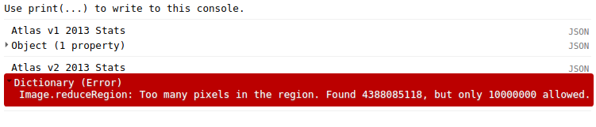
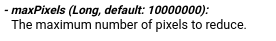
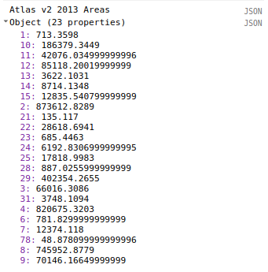
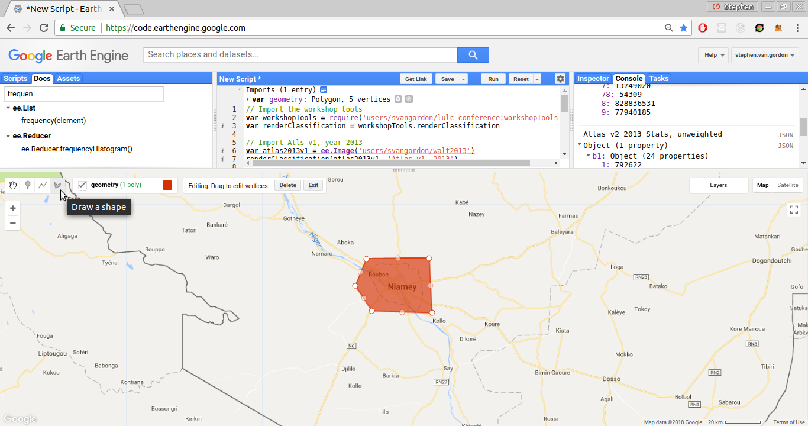
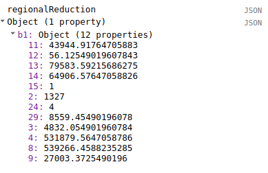
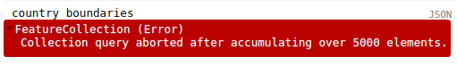
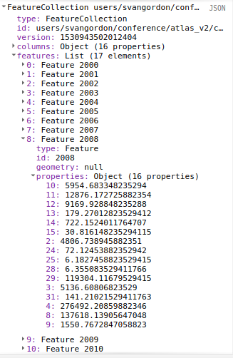
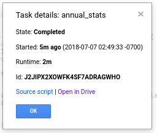
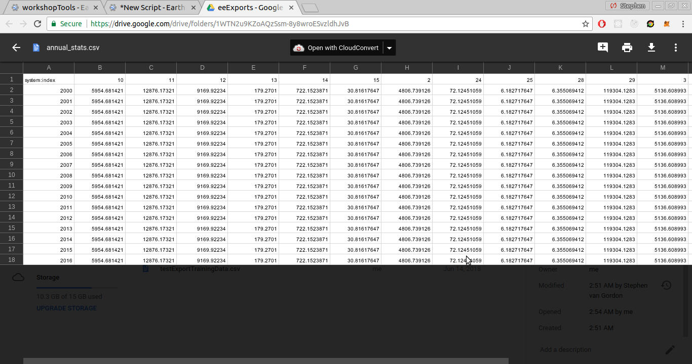

## Basic image statistics

In our last exercise, we rendered the Atlas and Atlas v2 images to the Earth Engine map. We will now explore ways to get more detailed statistics about the classifications.

We'll start by performing some statistical analysis on the Atlas dataset, including class areas and class histograms. This dataset is easier to work with, because it has fewer pixels. We'll look at getting statistics for custom geometries as well as at the national level. Then, we'll use those methods on the Atlas V2 dataset, and learn how to adjust our methods for that dataset. Using the Atlas V2 dataset, we'll look at some more complex measures, like statistics for land cover class conversion.

## Setup

Let's import some of the tools that we created last episode and saved in our workshop tools, and import some of the Atlas datasets.
~~~
// Import tools and datasets from workshopTools. Make sure to put in your own user name!
var workshopTools = require('users/svangordon/lulc-conference:workshopTools')
var displayAtlasClassification = workshopTools.displayAtlasClassification
var atlasV2_2013 = ee.Image('users/svangordon/conference/atlas_v2/classify/2013')
var atlasV2Collection = workshopTools.atlasV2Collection

~~~
{:. .source .language-javascript}

## Spatial Reductions

To get statistics about the Atlas and Atlas V2 data, we are going to use the `.reduceRegion` method. `.reduceRegion` provides a way to calculate a value or values from a region of an image.


_Diagram of .reduceRegion_


_Documentation for ee.Image().reduceRegion()_


Let's go ahead and reduce one of our Atlas V2 images. We will use the `ee.Reducer.frequencyHistogram()`, which counts the number of times each value is present.
~~~
var statsAtlasV2_2013 = atlasV2_2013.reduceRegion({
    reducer: ee.Reducer.frequencyHistogram(),
    scale: 30,
    maxPixels: 1e13
  })
print("atlasV2 stats 2013", statsAtlasV2_2013)
~~~
{:. .source .language-javascript}
~~~
atlasV2 stats 2013
JSON
Object (1 property)
  b1: Object (23 properties)
    1: 792622
    10: 207088161
    11: 46751150
    12: 94575778
    13: 4024559
    14: 9682372
    15: 14261712
    2: 970680921
    ...
~~~
{:. .output}

We didn't pass a geometry, so the reduction happens over the entire area of the image. The Atlas V2 dataset is at 30m scale, so we used that as the scale parameter.

> ## Max Pixels
>
> If we don't pass a `maxPixels` argument, Earth Engine will throw an error.
> ~~~
> Dictionary (Error)
>    Image.reduceRegion: Too many pixels in the region. Found 4388085118, but only 10000000 allowed.
> ~~~
> {:. .error}
> When reducing more than 10000000 pixels, we must 'ask permission' by passing a maxPixel value greater than the number of pixels in the image. Google wants to make sure that you are not accidentally requesting
{:. .callout}

In the output, you can see that we're returning an object with one property, `b1`. That is the class band for the image; if the image had more than one band, those bands would be present as well.

### Converting Counts to Areas
The `.frequencyHistogram()` reducer gives a count of pixels, not a total area. To convert pixel counts to area, we can multiply the pixel counts by an appropriate conversion coefficient: `4` for Atlas (`1 pixel == 4km^2`); `0.0009` for Atlas V2 (`1 pixel == 0.0009km^2`). We will multiply our vales by 0.0009, in this example.

~~~
var conversionCoefficient = 0.0009
// Get the `b1` (landcover) histogram
~~~
{:. .source .language-javascript}

We want to convert the areas of the `b1` band from pixel counts to areas.
~~~
var pixelCounts = ee.Dictionary(statsAtlasV2_2013.get('b1'))
~~~
{:. .source .language-javascript}

> ## Casting
>
> When we use a datatype like we do above, we're **casting**. We're telling Earth Engine that the result of `statsAtlasV2_2013.get('b1')` is going to be of the `ee.Dictionary` type. Earth Engine is processing a long set of instructions, and sometimes, it's not sure what the result of a certain process is going to be. Sometimes, typically when we use a method like `.get()`, we have to explicitly tell Earth Engine what kind of object a variable is going to be.
{:. .callout}

We now have a dictionary of pixels values that we will to convert to areas by multiplying by our conversion coefficient (0.0009). When we use `ee.Dictionary().map()`, we give it a function that takes the `key` and `value` of each element in the `ee.Dictionary` and returns the new `value`.
~~~
// Multiply the counts by the conversion coefficient
var areasAtlasV2_2013 = pixelCounts
  .map(function(key, value) {
    return ee.Number(value).multiply(0.0009)
  })
~~~
{:. .source .language-javascript}
~~~
Object (23 properties)
  1: 713.3598
  10: 186379.3449
  11: 42076.034999999996
  12: 85118.20019999999
  13: 3622.1031
  14: 8714.1348
  15: 12835.540799999999
  2: 873612.8289
  21: 135.117
  22: 28618.6941
  23: 685.4463
  24: 6192.8306999999995
  25: 17818.9983
  28: 887.0255999999999
  29: 402354.2655
  3: 66016.3086
  31: 3748.1094
  4: 820675.3203
  6: 781.8299999999999
  7: 12374.118
  78: 48.878099999999996
  8: 745952.8779
  9: 70146.16649999999
~~~
{:. .output}

## Getting Statistics for Regions

The method that we have laid out produces statistics for an entire image. However, it is also possible for us to get statistics for a defined region, such as a country or a custom geometry. When we make our `.reduceRegion` call, we will also provide a geometry to perform the reduction over.

Let's start by drawing a polygon on the map. This geometry is now available to us as `geometry`. That's the only difference between the methods: we're now providing a geometry for the reduction.
~~~
// Make sure to draw a custom geometry on the map!
var regionalAreas = atlasV2_2013.reduceRegion({
    reducer: ee.Reducer.frequencyHistogram(),
    region: geometry,
    scale: 30,
    maxPixels: 1e13
  })
regionalAreas = ee.Dictionary(regionalAreas.get('b1'))
  .map(function(key, value) {
    return ee.Number(value).multiply(0.0009)
  })

print('regional areas', regionalAreas)
~~~
{:. .source .language-javascript}

We can also perform regions over predefined geometries, like country boundaries. One great collection of country boundaries is the US DoS's Large-Scale International Boundary collection. We can import it as a feature collection:
~~~
var countryBoundaries = ee.FeatureCollection('USDOS/LSIB/2013')
~~~
{:. .source .language-javascript}
This collection is too large to display in the console (>5000 elements), but we can explore it further by adding it to the map and using the inspector or by printing an aggregate histogram of the collection.
~~~
Map.addLayer(countryBoundaries)
print(countryBoundaries.aggregate_histogram('name'))
~~~
{:. .source .language-javascript}

We're going to filter the collection with the `.filter()` method. When we filter a collection, we pass the method an `ee.Filter` object. In this case, we're going to use the `equals` filter, which only returns those features whose property 'name', is equal to the second parameter. We'll do Niger, feel free to try out a different country.

~~~
// Get boundaries for a single country
var countryGeometry = countryBoundaries.filter(ee.Filter.equals('name', 'NIGER'))
Map.addLayer(countryGeometry)
~~~
{:. .source}

Using a country as the region for a reduction is not any different that using our custom geometry:
~~~
var regionalAreas = atlasV2_2013.reduceRegion({
    reducer: ee.Reducer.frequencyHistogram(),
    region: countryGeometry,
    scale: 30,
    maxPixels: 1e13
  })
regionalAreas = ee.Dictionary(regionalAreas.get('b1'))
  .map(function(key, value) {
    return ee.Number(value).multiply(0.0009)
  })
print('country areas', regionalAreas)
~~~
{:. .source .language-javascript}

## Display Area as Bar Chart

Let's display the class counts as a bar chart, using the `ui.Chart.feature` methods. `ui.Chart.feature` displays a `ee.FeatureCollection`, so let's convert our dictionary of areas into a feature and put that feature in a feature collection.
~~~
var chartInput = ee.Feature(null, areasAtlasV2_2013)
chartInput = ee.FeatureCollection(chartInput)
~~~
{:. .source .language-javascript}

We now need a dictionary object to use to label our chart. The keys should be the classes value (eg, `2`) and the values should be that class's label (eg, `Savanne`). We can import just such a dictionary from a custom script I have created for the conference.

~~~
var atlasClassMetadata = require('users/svangordon/lulc-conference:atlasClassMetadata')
var nameDictionaryFrench = atlasClassMetadata.nameDictionaryFrench
print('nameDictionaryFrench', nameDictionaryFrench)
~~~
{:. .source .language-javascript}

For our chart labels, we need to make sure that only classes present in our chart input are in the chart labels, or else Earth Engine will give an error. So, we will select from the name dictionary those properties present on `chartInput`
~~~
var chartLabels = nameDictionaryFrench.select(chartInput.propertyNames())
~~~
{:. .source .language-javascript}

`ui.Chart` is a local or client-side method, meaning that its inputs must be JavaScript objects, not Earth Engine objects. We'll use `.getInfo()` to convert the chart labels to a JavaScript object.

~~~
var chartLabels = nameDictionaryFrench.select(chartInput.propertyNames()).getInfo()
~~~
{:. .source .language-javascript}

> ## `.getInfo()`
>
> The `.getInfo()` method converts an Earth Engine object on the Google server into a local JavaScript object. It is similar to the `print()` function: both make a request to the Earth Engine servers, and return a value. But while the `print()` function gets a value and displays it in the console, `.getInfo()` makes it available in the code. Furthermore, `.getInfo` halts the execution of our script while waiting for the Earth Engine servers to return a value. Because it pauses the running of your script, use `.getInfo()` sparingly. We mostly only need it when we need to provide a local function, such as `Map.addLayer` or `ui.Chart`, with a value that we need to calculate from Earth Engine objects.
{:. .callout}

We would like our scale to be logarithmic, so we will set that option for the vertical axis.
~~~
var areaChart = ui.Chart.feature.byProperty(ee.FeatureCollection(chartInput), chartLabels)
~~~
{:. .code .language-javascript}
It would be nice if we could style our chart a little bit. We can set a number of options for our chart; more information is available on the Google Charts page (but be aware that not all functionality in Google Charts is available in Earth Engine).

We're going to use `.setOptions` to label our X and Y axes, and to set our Y axis to logarithmic scale.
~~~
  .setOptions({
    vAxis: {
      title: 'km^2',
      scaleType: 'log'
    },
    hAxis: {
      title: 'Class'
    }
  })
print(areaChart)
~~~
{:. .code .language-javascript}

> ## Bug Fix
>
> The following code has a bug in it. What do we need to change?
> ~~~
> var atlasV2Image = ee.Image('users/svangordon/conference/atlasV2/classify/2000')
> var atlasClassCounts = atlasImage.reduceRegion({
>     reducer: ee.Reducer.frequencyHistogram(),
>     scale: 30,
>    maxPixels: 1e13
>   })
>   .get('b1')
> var atlasAreas = atlasClassCounts
>   .map(function(key, value) {
>     return ee.Number(value).multiply(0.0009)
>   })
> print(atlasAreas)
> ~~~
> {:. .source .language-javascript}
> > ## Solution
> >
> > Because we used `.get`, we need to cast `atlasClassCounts` to an `ee.Dictionary` type before we can use it further. Often, we need to cast after using a `.get` call. When you have an error message that's telling you that an object doesn't have a certain method (in this case, `.map`) but your *certain* that it does, it's a hint that you might need to use casting.
> > ~~~
> > atlasClassCounts.map is not a function
> > ~~~
> > {:. .error}
> >
> > We cast `atlasAreas` like this:
> > ~~~
> > var atlasAreas = ee.Dictionary(atlasClassCounts)
> > ~~~
> > {:. .source .language-javascript}
> {:. .solution}
{:. .challenge}

> ## Atlas Statistics
>
> We'd like to get statistics for Atlas as well as Atlas V2. Our method almost totally works, but it needs a few fixes. How do we need to change the following code to get class areas for Atlas? To check your answer, know that the Open Mine class (class `78`) should have an area of 1200.
> ~~~
> var atlasImage = ee.Image('users/svangordon/conference/atlas/swa_2013lulc_2km')
> var atlasClassCounts = atlasImage.reduceRegion({
>     reducer: ee.Reducer.frequencyHistogram(),
>     scale: 30,
>    maxPixels: 1e13
>   })
>   .get('b1')
> var atlasAreas = atlasClassCounts
>   .map(function(key, value) {
>     return ee.Number(value).multiply(0.0009)
>   })
> print(atlasAreas)
> ~~~
> {:. .source .language-javascript}
> > ## Solution
> > We must change our conversion coefficient from 0.0009 to 4, as we are going from (30m scale to 2km scale).
> > ~~~
> > var atlasImage = ee.Image('users/svangordon/conference/atlas/swa_2013lulc_2km')
> > var atlasClassCounts = atlasImage.reduceRegion({
> >     reducer: ee.Reducer.frequencyHistogram(),
> >     // scale: 30,
> >    maxPixels: 1e13
> >   })
> >   .get('b1')
> > var atlasAreas = atlasClassCounts
> >   .map(function(key, value) {
> >     return ee.Number(value).multiply(0.0009)
> >   })
> > print(atlasAreas)
> > ~~~
> > {:. .source .language-javascript}
> {:. .solution}
{:. .challenge
}
## Time series data

Now that we have statistics for a single year, let's get statistics for the entire Atlas V2 collection. We will map over the `atlasV2Collection`, converting each image into a feature. We can then export that collection, or use it to plot time series charts.

First, we need to create a function that gets an image's class counts. This will take a collection of classified images and a conversion factor to use to convert pixel counts to areas. The function will also take a geometry to perform the reduction over. If no geometry is provided, this value will be `undefined`, and thus will default to the footprint of the images.
~~~
function getCollectionAreas(imageCollection, conversionFactor, reductionGeometry) {
  imageCollection = ee.ImageCollection(imageCollection)
  var areaCollection = imageCollection.map(function(image) {
~~~
{:. .source .language-javascript}

Inside the body of our `.map` function, we're going to do exactly what we did before with our Atlas V2 image.
~~~
    var pixelCounts = image.reduceRegion({
        reducer: ee.Reducer.frequencyHistogram(),
        geometry: reductionGeometry,
        maxPixels: 1e13
      })
      .get('b1')
    var classAreas = ee.Dictionary(pixelCounts)
      .map(function(key, value) {
        return ee.Number(value).multiply(conversionCoefficient)
      })
    return ee.Feature(null, classAreas)  
  })
~~~
{:. .source .language-javascript}
We must return the results as an `ee.Feature` (with a null geometry) because an `ee.FeatureCollection` can only contain images and features

When we try and display a chart later on, we will need to know what classes are present in the feature collection. So, let's add the classes of the first feature in the collection as a property that we can reference later. We will take the first element in the collection that we just took, convert it to a dictionary and get its keys.

~~~
  areaCollection = ee.FeatureCollection(areaCollection)
    .set('classes', ee.Feature(areaCollection.first()).toDictionary().keys())
  return areaCollection
}
~~~
{:. .source}


Let's take a look:
~~~
var atlasV2Collection = ee.ImageCollection('users/svangordon/conference/atlas_v2/collections/classify')
print(getCollectionAreas(atlasV2Collection, 0.0009))
~~~
{:. .source}
~~~
FeatureCollection users/svangordon/conference/atlas_v2/collections/classify (17 elements, 0 columns)
  type: FeatureCollection
  id: users/svangordon/conference/atlas_v2/collections/classify
  version: 1530943502012404
  columns: Object (0 properties)
  features: List (17 elements)
    0: Feature 2000
      type: Feature
      id: 2000
      geometry: null
      properties: Object (23 properties)
        1: 723.816
        10: 177733.31579999998
        11: 44079.2838
        12: 92509.6356
        13: 3528.756
        14: 5168.469599999999
        15: 7843.4136
        2: 1005695.6229
        21: 156.0501
        ...
~~~
{:. .output}

Outstanding!

We can get aggregate statistics for our collection of areas. `ee.FeatureCollection` has several aggregator methods available. For example, we could see the average area of the `Forest` class, which is class `2`:
~~~
var meanForestArea = atlasV2Areas.aggregate_mean("2")
print('meanForestArea', meanForestArea)
~~~
{:. .source .language-javascript}
~~~
meanForestArea
920922.5752411763
~~~
{:. .output}

We can also perform these reductions over multiple columns at once using `reduceColumns`. For example, we can produce the mean value of each land cover class. To use reduce columns, we need to provide the names of the columns we are interested in. If you are only interest in certain columns, you can provide them as a list, or you can use the `classes` property that we set on our collection earlier.

Here, we reduce the collection to the mean value for each land cover type. We tell Earth Engine that we want to do the reduction separately for each class, and that we want to do it for every class in our list of classes.
~~~
var atlasV2Classes = atlasV2Areas.get('classes')
var meanAreaAtlasV2 = atlasV2Areas.reduceColumns(
  ee.Reducer.mean().forEach(atlasV2Classes),
  atlasV2Areas.get('classes')
)
print(meanAreaAtlasV2)
~~~
{:. .source .language-javascript}

## Time Series Charts
Now that we have class areas for each year in our series we can create time series charts of class areas.

Earlier, we created a chart with `ui.Chart.byProperty`; now we are going to use `ui.Chart.byFeature`.

We'll use the same method as before to get our dictionary of series labels.
~~~
chartInput = atlasV2Areas
chartLabels = nameDictionaryFrench.select(chartInput.get('classes')).getInfo()
~~~
{:. .source .language-javascript}

We want our chart to be a line chart, instead of the default column chart.
~~~
var timeSeriesChart = ui.Chart.feature.byFeature(chartInput)
  .setChartType('LineChart')
~~~
{:. .source .language-javascript}
We pass the names of the classes a little bit differently:
~~~
  .setSeriesNames(chartLabels)
~~~
{:. .source .language-javascript}  
And now we set the chart options.
~~~
.setOptions({
    vAxis: {
      title: 'km^2',
      scaleType: 'log'
    },
    hAxis: {
      title: 'year'
    }
  })
  print(timeSeriesChart)
~~~
{:. .source .language-javascript}


## Exporting Data
Now that we've produced statistics for our images, let's export them from Earth Engine. Earth Engine allows you to export feature collections to Google Drive. 

### Class Areas as a function
For convenience, let's write a function to convert pixel counts to class areas. `countsToAreas` will take a reducer output, gets its `b1` property, and multiply all of its values by a `conversionCoefficient`.



function countsToAreas(reducerOutput, conversionCoefficient) {
  var classBand = 'b1'

  // Get class band and cast to Dictionary; .get call makes casting necessary
  var classCounts = ee.Dictionary(reducerOutput.get(classBand))
    .remove(['null'], true) // Drop any null values; (ie, any pixels that don't have data).

  // Multiply the counts by the conversion coefficient
  var classAreas = classCounts.map(function(key, value) {
    return ee.Number(value).multiply(conversionCoefficient)
  })  
}

atlasStats_2013 = atlas_2013
  .reduceRegion(ee.Reducer.frequencyHistogram())
print('atlasAreas 2013', countsToAreas(atlasStats_2013, atlasConversionCoefficient))




### Data Export: Copying from console

You will very likely want to get these class count numbers out of Earth Engine. By far, the simplest way to do this is to display the data in the console using `print()` (as we have done above) and then copy and paste it.

So, first you print the data object to the console.


Then, click the word `JSON` on the right side of the console, on the same line as your data object. This will convert the data object to its raw JSON representation.


Now, click the underlined curly brace (accolade). This will select the entire JSON object.


Use `ctrl-c` to copy that JSON object, and `ctrl-v` to paste it into whatever program is its destination.

### Atlas v2 Class Counts

We've gotten Atlas v1 class counts, but now lets get the Atlas v2 class counts.

Let's load the Atlas V2 data.

// Load Atlas V2 2013
var atlasV2_2013 = workshopTools.atlasV2_2013


Now let's try the same method that we used earlier.

// Get the Atlas v2 frequency histogram and display it.
var reductionAtlasV2_2013 = atlasV2_2013.reduceRegion(ee.Reducer.frequencyHistogram())
print('Atlas v2 2013 Pixel Counts', reductionAtlas2013v2)




An error! But what does that mean?

### Max Pixels

The `.reduceRegion()` method has a `maxPixels` argument; by default it is `10000000`. The `maxPixels` argument is the maximum number of pixels the reduction is allowed to process. The Atlas V2 dataset has many more pixels than the Atlas dataset, so reducing the Atlas V2 dataset resulted in an error but reducing the Atlas dataset did not.



`maxPixels` is really just a 'guard'. Google will let you process a large number of pixels with a reducer, but they want to make sure that you're intending to process so many pixels. You can actually process a very large number of pixels, as many as 1e13 to 1e15, depending on the exact method. All that is needed is to 'ask permission' by passing a `maxPixels` value greater than the number of pixels in the image you are reducing. So, let's try that reduction again with a max pixel value of `1e13`.

<!-- Let's also provide a scale parameter. It's a good habit to explicitly provide Earth Engine with a scale to perform reductions at. -->


// Get the Atlas v2 frequency histogram and display it.
var reductionAtlas2013v2 = atlas2013v2.reduceRegion({
  reducer: ee.Reducer.frequencyHistogram(),
  maxPixels: 1e13,
  <!-- scale: 30 -->
})
print('Atlas v2 2013 Pixel Counts', reductionAtlas2013v2)



_Class areas for Atlas V2, 2013_

## Regional image statistics

We've gotten statistics for an entire image, but what if we only want statistics for part of an image? For example, what if we want to get the class counts for a country?

To get statistics for a region, we first need to define the region that we are interested in. Using the geometry tool, draw a polygon around the city of Niamey (or anywhere else you would like).



You will notice that this geometry now appears at the top of your code, and we can refer to it in our code as `geometry`. Let's try our reduction again, but this time, we're going to pass a `geometry` argument to tell Earth Engine what region we want statistics for.

Let's look at pixel counts again:

```
// Get the land cover class counts for a custom geometry
var regionalReduction = atlasV2_2013.reduceRegion({
  reducer: ee.Reducer.frequencyHistogram(),
  maxPixels: 1e13,
  geometry: geometry
});

print('regionalReduction', regionalReduction)
```



You will notice that the pixel counts are no longer integers. By default, in Earth Engine a frequency histogram is a _weighted_ reduction. Any pixels that are partly inside of the geometry will be weighted based on how much of that pixel falls within the geometry. For example, if 75% of a pixel falls within the region we are reducing, it will only count as 75% of a pixel. It is also possible to perform an _unweighted_ reduction. In an unweighted reduction, pixels that are on the edge of the geometry will be counted if their centerpoint falls within the bounds of the geometry, and will be ignored otherwise. This is more similar to the behavior in ArcGIS. The following performs an unweighted frequency reduction:

```
// Get the land cover class counts for a custom geometry
var regionalReductionUnweighted = atlas2013v2.reduceRegion({
  reducer: ee.Reducer.frequencyHistogram().unweighted(),
  maxPixels: 1e13,
  geometry: geometry
});

print('regionalReductionUnweighted', regionalReductionUnweighted)
```

Try drawing a few custom geometries and getting the class counts.

## National image statistics

We've gotten image statistics for a custom geometry, but what if we would like to get statistics for a known geometry, like a country? Shapefiles of country borders are already available in Earth Engine, and it is also easy to load your own shapefiles into Earth Engine (for example, if you wanted regional or provincial boundaries.)

We're first going to load a Feature Collection that contains national boundaries. In the past, I have used (this Fusion Table)[https://fusiontables.google.com/DataSource?docid=1tdSwUL7MVpOauSgRzqVTOwdfy17KDbw-1d9omPw], though I've become dissatisfied with the accuracy of its coastlines. So, we're going to use the US Department of State's (Large-Scale International Boundary dataset)[https://code.earthengine.google.com/dataset/USDOS/LSIB/2013] (LSIB).

Let's load that dataset and display it on the map.

```
// Load LSIB country boundaries and display it on the map
var countryBoundaries = ee.FeatureCollection('USDOS/LSIB/2013')
Map.addLayer(countryBoundaries)
```

(As an aside, the map represents the US government's official position on where various boundaries fall; it is interesting to see where the US government draws contentious borders, like the ones between India and China.)

To select countries of interest from this collection, we're going to filter the collection using the `name` property. We would like to double check the way that names are rendered (for example, are names recorded as `Name`, `NAME` or `name`?) The collection is too large to print to the console:

```
print('country boundaries', countryBoundaries)
```

_Attempting to print the collection of countries results in an error._

Instead, you can find country names by using the Inspector tab or by using the `.aggregate_histogram()` reduction:

```
print(countryBoundaries.aggregate_histogram('name'))
```

Let's get statistics for Niger:

var countryGeometry = countryBoundaries.filter(ee.Filter.eq('name', 'NIGER'))

// Get the Atlas v2 frequency histogram for Niger
var reductionCountry_2013 = atlasV2_2013.reduceRegion({
  reducer: ee.Reducer.frequencyHistogram(),
  maxPixels: 1e13,
  geometry: countryGeometry,
  scale: 30
})
var areasCountry_2013 = countsToAreas(reductionCountry_2013, atlasV2ConversionCoefficient)

print('Country Areas', areasCountry_2013)


## Statistics for Collections

We've created statistics for a single image. Now, we will get class areas for an entire collection, and then export those values as a CSV to Google Drive.

We're going to map over the `atlasV2Collection`, reducing each image to a feature containing its class areas. We can then export that feature collection.


_Annual Atlas V2 stats for Niger_


// Create the export job.
Export.table.toDrive({
  collection: ee.FeatureCollection(collectionStatistics),
  folder: 'eeExports',
  fileFormat: "CSV",
  description: title
});


When the export is complete

you can view it in drive.




