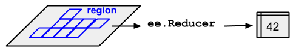
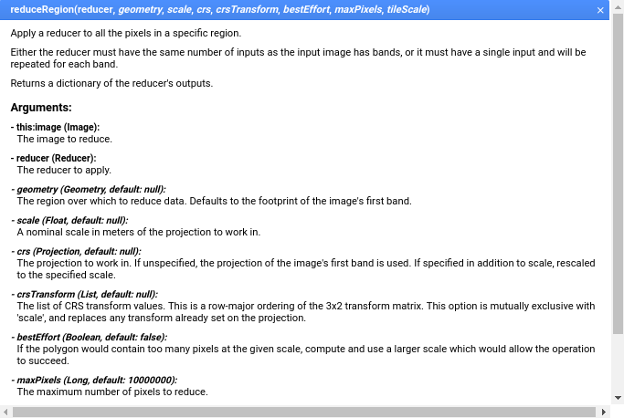

## Basic image statistics

In our last exercise, we rendered the Atlas and AtlasV2 images to the Earth Engine map. We will now explore ways to get more detailed statistics about the classifications.

We'll start by performing some statistical analysis on the datasets, including class areas and class histograms. We'll look at getting statistics for custom geometries as well as at the national level. Then, we will look at ways that we can display charts expressing information about those datasets in Earth Engine.

## Setup

Let's import some of the tools that we created last episode and saved in our workshop tools, and import some of the Atlas datasets.
~~~
// Import tools and datasets from workshopTools. Make sure to put in your own user name!
var workshopTools = require('users/svangordon/lulc-conference:workshopTools')
var atlasV2_2013 = ee.Image('users/svangordon/conference/atlas_v2/classify/2013')
var atlasV2Collection = workshopTools.atlasV2Collection

~~~
{:. .source .language-javascript}

## Spatial Reductions

To get statistics about the Atlas and Atlas V2 data, we are going to use the `.reduceRegion` method. `.reduceRegion` provides a way to calculate a value or values from a region of an image.

_Diagram of .reduceRegion_

_Documentation for ee.Image().reduceRegion()_

Let's go ahead and reduce one of our Atlas V2 images. We will use the `ee.Reducer.frequencyHistogram()`, which counts the number of times each value is present. Note that these numbers are not the areas of each class, but instead are the number of pixels of each class.
~~~
var imageReduction = atlasV2_2013.reduceRegion({
    reducer: ee.Reducer.frequencyHistogram(),
    scale: 30,
    maxPixels: 1e13
  })
print("atlasV2 stats 2013", imageReduction)
~~~
{:. .source .language-javascript}
~~~
atlasV2 stats 2013
JSON
Object (1 property)
  b1: Object (23 properties)
    1: 792622
    10: 207088161
    11: 46751150
    12: 94575778
    13: 4024559
    14: 9682372
    15: 14261712
    2: 970680921
    ...
~~~
{:. .output}

We didn't pass a geometry, so the reduction happens over the entire area of the image. The Atlas V2 dataset is at 30m scale, so we used that as the scale parameter.

> ## Max Pixels
>
> If we don't pass a `maxPixels` argument, Earth Engine will throw an error.
> ~~~
> Dictionary (Error)
>    Image.reduceRegion: Too many pixels in the region. Found 4388085118, but only 10000000 allowed.
> ~~~
> {:. .error}
> When reducing more than 10000000 pixels, we must 'ask permission' by passing a maxPixel value greater than the number of pixels in the image. Google wants to make sure that you are not accidentally requesting
{:. .callout}

In the output, you can see that we're returning an object with one property, `b1`. That is the class band for the image; if the image had more than one band, those bands would be present as well.

Let's take only the `b1` property of our reduction output, and cast it to a dictionary.
~~~
var pixelCounts = ee.Dictionary(statsAtlasV2_2013.get('b1'))
~~~
{:. .source .language-javascript}
> ## Casting
>
> When we use a datatype like we do above, we're **casting**. We're telling Earth Engine that the result of `imageReduction.get('b1')` is going to be of the `ee.Dictionary` type. Earth Engine is processing a long set of instructions, and sometimes, it's not sure what the result of a certain process is going to be. Sometimes, typically when we use a method like `.get()`, we have to explicitly tell Earth Engine what kind of object a variable is going to be.
{:. .callout}

### Converting Counts to Areas
The `.frequencyHistogram()` reducer gives a count of pixels, not a total area. To convert pixel counts to area, we can multiply the pixel counts by an appropriate conversion coefficient: `4` for Atlas (`1 pixel == 4km^2`); `0.0009` for Atlas V2 (`1 pixel == 0.0009km^2`). We will multiply our vales by 0.0009, in this example.

~~~
var conversionCoefficient = 0.0009
// Get the `b1` (landcover) histogram
~~~
{:. .source .language-javascript}

We have a dictionary of pixels counts that we want to convert to areas by multiplying by our conversion coefficient (0.0009). We will use `ee.Dictionary().map()`. When we use `ee.Dictionary().map()`, we give it a function that takes the `key` and `value` of each element in the `ee.Dictionary` and returns the new `value`.
~~~
// Multiply the counts by the conversion coefficient
var classAreas = pixelCounts
  .map(function(key, value) {
    return ee.Number(value).multiply(conversionCoefficient)
  })

print('classAreas', classAreas)
~~~
{:. .source .language-javascript}
~~~
Object (23 properties)
  1: 713.3598
  10: 186379.3449
  11: 42076.034999999996
  12: 85118.20019999999
  13: 3622.1031
  14: 8714.1348
  15: 12835.540799999999
  2: 873612.8289
  21: 135.117
  22: 28618.6941
  23: 685.4463
  24: 6192.8306999999995
  25: 17818.9983
  28: 887.0255999999999
  29: 402354.2655
  3: 66016.3086
  31: 3748.1094
  4: 820675.3203
  6: 781.8299999999999
  7: 12374.118
  78: 48.878099999999996
  8: 745952.8779
  9: 70146.16649999999
~~~
{:. .output}

## Getting Statistics for Regions

The method that we have laid out produces statistics for an entire image. However, it is also possible for us to get statistics for a defined region, such as a country or a custom geometry. When we make our `.reduceRegion` call, we will also provide a geometry to perform the reduction over.

#### Custom Geometry
Let's start by drawing a polygon on the map. This geometry is now available to us as `geometry`. That's the only difference between getting statistics for a region and for an entire image: we are now providing a geometry for the reduction.
~~~
// Make sure to draw a custom geometry on the map!
// Get the pixel counts
var regionalAreas = atlasV2_2013.reduceRegion({
    reducer: ee.Reducer.frequencyHistogram(),
    geometry: geometry,
    scale: 30,
    maxPixels: 1e13
  })
// Convert pixel counts to areas
regionalAreas = ee.Dictionary(regionalAreas.get('b1'))
  .map(function(key, value) {
    return ee.Number(value).multiply(conversionCoefficient)
  })

print('regional areas', regionalAreas)
~~~
{:. .source .language-javascript}

#### Country Geometries
We can also perform regions over predefined geometries, like country boundaries. One collection of country boundaries that is available in Earth Engine is the US DoS's Large-Scale International Boundary collection. We can import it as a feature collection:
~~~
var countryBoundaries = ee.FeatureCollection('USDOS/LSIB/2013')
~~~
{:. .source .language-javascript}
This collection is too large to display in the console (>5000 elements), but we can explore it further by adding it to the map and using the inspector or by printing an aggregate histogram of the collection.
~~~
Map.addLayer(countryBoundaries)
print(countryBoundaries.aggregate_histogram('name'))
~~~
{:. .source .language-javascript}

We're going to filter the collection with the `.filter()` method. When we filter a collection, we pass the method an `ee.Filter` object. In this case, we're going to use the `equals` filter, which only returns those features whose property 'name', is equal to the second parameter. We'll do Niger, feel free to try out a different country.

~~~
// Get boundaries for a single country
var countryGeometry = countryBoundaries.filter(ee.Filter.equals('name', 'NIGER'))
Map.addLayer(countryGeometry)
~~~
{:. .source}

Using a country as the region for a reduction is not any different than using our custom geometry:
~~~
var regionalAreas = atlasV2_2013.reduceRegion({
    reducer: ee.Reducer.frequencyHistogram(),
    region: countryGeometry,
    scale: 30,
    maxPixels: 1e13
  })
regionalAreas = ee.Dictionary(regionalAreas.get('b1'))
  .map(function(key, value) {
    return ee.Number(value).multiply(0.0009)
  })
print('country areas', regionalAreas)
~~~
{:. .source .language-javascript}

## Exporting an Image

You might like to export a region of a classified image so that you can use it outside of Earth Engine. We can do this by exporting the image to Google Drive.

~~~
// Export a classified Image

Export.image.toDrive({
  image: atlasV2_2013,
  folder: 'classifiedLulc',
  region: countryGeometry,
  fileNamePrefix: 'atlasV2_2013',
  scale: 30,
  description: 'atlasV2_2013',
  maxPixels: 1e13
});
~~~
{:. .source .language-javascript}

This outputs the image as a `.tiff` file. That's an ideal choice if you are planning to work with the image in another kind of GIS software, such as QGis. But, if you would prefer to display the image in a way that's easier to display -- for example, if you want an image for a presentation, or to put on a website, you will want to conver the image to RGB format. Use the `.visualize` method, and pass the visualization parameters you would usually use to display the image on the map. Earth Engine will convert the image to a three band RGB image.

~~~
// Export a classified Image

Export.image.toDrive({
  image: atlasV2_2013.visualize(atlasVisParams),
  folder: 'classifiedLulc',
  region: classificationZone,
  fileNamePrefix: 'atlasV2_2013',
  scale: 30,
  description: 'atlasV2_2013',
  maxPixels: 1e13
});
~~~
{:. .source .language-javascript}

## Display Area as Bar Chart

Let's display the class counts as a bar chart, using the `ui.Chart.feature` methods. `ui.Chart.feature` displays a `ee.FeatureCollection`, so we will convert our dictionaries of areas into features and turn those features into a feature collection.
> ## Null-geometry Features
>
> The first parameter we pass to feature is the geometry. In this case, the feature does not have a geometry, so we pass `null` instead.
{:. .callout}

~~~
var chartInput = ee.Feature(null, classAreas)
chartInput = ee.FeatureCollection(chartInput)
~~~
{:. .source .language-javascript}

We now need a dictionary object to use to label our chart. The keys should be the classes value (eg, `2`) and the values should be that class's label (eg, `Savanne`). We can import just such a dictionary from a custom script I have created for the conference.

~~~
var atlasClassMetadata = require('users/svangordon/lulc-conference:atlasClassMetadata')
var nameDictionaryFrench = atlasClassMetadata.nameDictionaryFrench
print('nameDictionaryFrench', nameDictionaryFrench)
~~~
{:. .source .language-javascript}

For our chart labels, we need to make sure that only classes present in our chart input are in the chart labels, or else Earth Engine will give an error. So, we will select from the name dictionary those properties present on `chartInput`
~~~
var chartLabels = nameDictionaryFrench.select(chartInput.propertyNames())
~~~
{:. .source .language-javascript}

`ui.Chart` is a local or client-side method, meaning that its inputs must be JavaScript objects, not Earth Engine objects. We'll use `.getInfo()` to convert the chart labels to a JavaScript object.

~~~
var chartLabels = nameDictionaryFrench.select(chartInput.propertyNames()).getInfo()
~~~
{:. .source .language-javascript}

> ## `.getInfo()`
>
> The `.getInfo()` method converts an Earth Engine object on the Google server into a local JavaScript object. It is similar to the `print()` function: both make a request to the Earth Engine servers, and return a value. But while the `print()` function gets a value and displays it in the console, `.getInfo()` makes it available in the code. Furthermore, `.getInfo` halts the execution of our script while waiting for the Earth Engine servers to return a value. Because it pauses the running of your script, use `.getInfo()` sparingly. We mostly only need it when we need to provide a local function, such as `Map.addLayer` or `ui.Chart`, with a value that we need to calculate from Earth Engine objects.
{:. .callout}

> ## Why does it take so long?
>
> The first time that you run this script, it will probably take a very long time to run, and your browser window will be unresponsive. Why is that?
>
> `.getInfo()` halts all code execution until a value is returned from the Earth Engine servers. If it takes a long time for the Earth Engine servers to calculate what value should be returned from the `.getInfo` call, then your browser will be frozen for a long time.
>
> After the `.getInfo` call completes the first time, running the script over again will not take very long at all. Why is that? Earth Engine uses **caching**. Remember, what you are sending to the Earth Engine servers is actually a set of instructions. Earth Engine holds on to the results from a given set of instructions for about 24 hours. If it encounters _exactly_ the same set of instructions during that period, it will immediately return the result for that set of instructions instead of recalculating those instructions.

We would like our scale to be logarithmic, so we will set that option for the vertical axis.
~~~
var areaChart = ui.Chart.feature.byProperty(ee.FeatureCollection(chartInput), chartLabels)
~~~
{:. .code .language-javascript}
It would be nice if we could style our chart a little bit. We can set a number of options for our chart; more information is available on the Google Charts page (but be aware that not all functionality in Google Charts is available in Earth Engine).

We're going to use `.setOptions` to label our X and Y axes, and to set our Y axis to logarithmic scale.
> ## Google Charts
>
> Earth Engine displays charts through the Google Charts API. To read more about what kinds of options are available, you can read the [Google Charts documentation](https://developers.google.com/chart/interactive/docs/gallery/linechart). Unfortunately, the API isn't very well documented, and a lot of the options that are available in Google Charts aren't available in Earth Engine: you're kind of shooting in the dark here.
{:. .callout}

~~~
  .setOptions({
    vAxis: {
      title: 'km^2',
      scaleType: 'log'
    },
    hAxis: {
      title: 'Class'
    }
  })
print(areaChart)
~~~
{:. .code .language-javascript}

> ## Bug Fix
>
> The following code has a bug in it. What do we need to change?
> ~~~
> var atlasV2Image = ee.Image('users/svangordon/conference/atlasV2/classify/2000')
> var atlasClassCounts = atlasImage.reduceRegion({
>     reducer: ee.Reducer.frequencyHistogram(),
>     scale: 30,
>    maxPixels: 1e13
>   })
>   .get('b1')
> var atlasAreas = atlasClassCounts
>   .map(function(key, value) {
>     return ee.Number(value).multiply(0.0009)
>   })
> print(atlasAreas)
> ~~~
> {:. .source .language-javascript}
> > ## Solution
> >
> > Because we used `.get`, we need to cast `atlasClassCounts` to an `ee.Dictionary` type before we can use it further. Often, we need to cast after using a `.get` call. When you have an error message that's telling you that an object doesn't have a certain method (in this case, `.map`) but you are *certain* that it does, it's a hint that you might need to use casting.
> > ~~~
> > atlasClassCounts.map is not a function
> > ~~~
> > {:. .error}
> >
> > We cast `atlasAreas` like this:
> > ~~~
> > var atlasAreas = ee.Dictionary(atlasClassCounts)
> > ~~~
> > {:. .source .language-javascript}
> {:. .solution}
{:. .challenge}

> ## Atlas Statistics
>
> We'd like to get statistics for Atlas as well as Atlas V2. Our method almost totally works, but it needs a few fixes. How do we need to change the following code to get class areas for Atlas? To check your answer, know that the Open Mine class (class `78`) should have an area of 1200.
> ~~~
> var atlasImage = ee.Image('users/svangordon/conference/atlas/swa_2013lulc_2km')
> var atlasClassCounts = atlasImage.reduceRegion({
>     reducer: ee.Reducer.frequencyHistogram(),
>     scale: 30,
>    maxPixels: 1e13
>   })
>   .get('b1')
> var atlasAreas = atlasClassCounts
>   .map(function(key, value) {
>     return ee.Number(value).multiply(0.0009)
>   })
> print(atlasAreas)
> ~~~
> {:. .source .language-javascript}
> > ## Solution
> > We must change our conversion coefficient from 0.0009 to 4, as we are going from (30m scale to 2km scale).
> > ~~~
> > var atlasImage = ee.Image('users/svangordon/conference/atlas/swa_2013lulc_2km')
> > var atlasClassCounts = atlasImage.reduceRegion({
> >     reducer: ee.Reducer.frequencyHistogram(),
> >     // scale: 30,
> >    maxPixels: 1e13
> >   })
> >   .get('b1')
> > var atlasAreas = atlasClassCounts
> >   .map(function(key, value) {
> >     return ee.Number(value).multiply(0.0009)
> >   })
> > print(atlasAreas)
> > ~~~
> > {:. .source .language-javascript}
> {:. .solution}
{:. .challenge
}
## Time series data

Now that we have statistics for a single year, let's get statistics for the entire Atlas V2 collection. We will map over the `atlasV2Collection`, converting each image into a feature. We can then export that collection, or use it to plot time series charts.

First, we need to create a function that gets an image's class counts. This will take a collection of classified images and a conversion factor to use to convert pixel counts to areas. The function will also take a geometry to perform the reduction over. If no geometry is provided, this value will be `undefined`, and thus will default to the footprint of the images.
~~~
function getCollectionAreas(imageCollection, conversionFactor, reductionGeometry) {
  imageCollection = ee.ImageCollection(imageCollection)
  var areaCollection = imageCollection.map(function(image) {
~~~
{:. .source .language-javascript}

Inside the body of our `.map` function, we're going to do exactly what we did before with our Atlas V2 image.
~~~
    var pixelCounts = image.reduceRegion({
        reducer: ee.Reducer.frequencyHistogram(),
        geometry: reductionGeometry,
        maxPixels: 1e13
      })
      .get('b1')
    var classAreas = ee.Dictionary(pixelCounts)
      .map(function(key, value) {
        return ee.Number(value).multiply(conversionCoefficient)
      })
    return ee.Feature(null, classAreas)  
  })
~~~
{:. .source .language-javascript}
We must return the results as an `ee.Feature` (with a null geometry) because an `ee.FeatureCollection` can only contain images and features

When we try and display a chart later on, we will need to know what classes are present in the feature collection. So, let's add the classes of the first feature in the collection as a property that we can reference later. We will take the first element in the collection that we just took, convert it to a dictionary and get its keys.

~~~
  areaCollection = ee.FeatureCollection(areaCollection)
    .set('classes', ee.Feature(areaCollection.first()).toDictionary().keys())
  return areaCollection
}
~~~
{:. .source}

Let's take a look:
~~~
var atlasV2Collection = ee.ImageCollection('users/svangordon/conference/atlas_v2/collections/classify')
print(getCollectionAreas(atlasV2Collection, 0.0009))
~~~
{:. .source}
~~~
FeatureCollection users/svangordon/conference/atlas_v2/collections/classify (17 elements, 0 columns)
  type: FeatureCollection
  id: users/svangordon/conference/atlas_v2/collections/classify
  version: 1530943502012404
  columns: Object (0 properties)
  features: List (17 elements)
    0: Feature 2000
      type: Feature
      id: 2000
      geometry: null
      properties: Object (23 properties)
        1: 723.816
        10: 177733.31579999998
        11: 44079.2838
        12: 92509.6356
        13: 3528.756
        14: 5168.469599999999
        15: 7843.4136
        2: 1005695.6229
        21: 156.0501
        ...
~~~
{:. .output}

Outstanding!

We can get aggregate statistics for our collection of areas. `ee.FeatureCollection` has several aggregator methods available. For example, we could see the average area of the `Forest` class, which is class `2`:
~~~
var meanForestArea = atlasV2Areas.aggregate_mean("2")
print('meanForestArea', meanForestArea)
~~~
{:. .source .language-javascript}
~~~
meanForestArea
920922.5752411763
~~~
{:. .output}

We can also perform these reductions over multiple columns at once using `reduceColumns`. For example, we can produce the mean value of each land cover class. To use reduce columns, we need to provide the names of the columns we are interested in. If you are only interest in certain columns, you can provide them as a list, or you can use the `classes` property that we set on our collection earlier.

Here, we reduce the collection to the mean value for each land cover type. We tell Earth Engine that we want to do the reduction separately for each class, and that we want to do it for every class in our list of classes.
~~~
var atlasV2Classes = atlasV2Areas.get('classes')
var meanAreaAtlasV2 = atlasV2Areas.reduceColumns(
  ee.Reducer.mean().forEach(atlasV2Classes),
  atlasV2Areas.get('classes')
)
print(meanAreaAtlasV2)
~~~
{:. .source .language-javascript}

## Time Series Charts
Now that we have class areas for each year in our series we can create time series charts of class areas.

Earlier, we created a chart with `ui.Chart.byProperty`; now we are going to use `ui.Chart.byFeature`.

We'll use the same method as before to get our dictionary of series labels.
~~~
chartInput = atlasV2Areas
chartLabels = nameDictionaryFrench.select(chartInput.get('classes')).getInfo()
~~~
{:. .source .language-javascript}

We want our chart to be a line chart, instead of the default column chart.
~~~
var timeSeriesChart = ui.Chart.feature.byFeature(chartInput)
  .setChartType('LineChart')
~~~
{:. .source .language-javascript}
We pass the names of the classes a little bit differently:
~~~
  .setSeriesNames(chartLabels)
~~~
{:. .source .language-javascript}  
And now we set the chart options.
~~~
.setOptions({
    vAxis: {
      title: 'km^2',
      scaleType: 'log'
    },
    hAxis: {
      title: 'year'
    }
  })
  print(timeSeriesChart)
~~~
{:. .source .language-javascript}

## Exporting Data
Now that we've produced statistics for our images, let's export them from Earth Engine. Earth Engine allows you to export feature collections to Google Drive. Conveniently, our areas are already a feature collection:
~~~
Export.table.toDrive({
  collection: atlasV2Areas,
  folder: "eeExports",
  fileFormat: "CSV",
  description: "atlasV2Areas"
});
~~~
{:. .source .language-javascript}

We can then execute the task in the **Tasks** tab of the code editor. Once the export is completed, you can view it in Google Drive.
