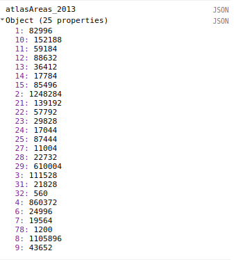
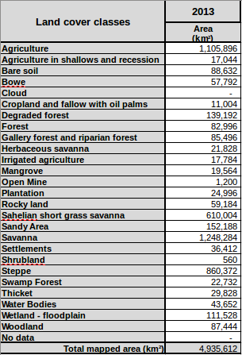

## Basic image statistics

In our last exercise, we rendered the Atlas and Atlas v2 images to the Earth Engine map. We will now explore ways to get more detailed statistics about the classifications.

We'll start by performing some statistical analysis on the Atlas dataset, including class areas and class histograms. This dataset is easier to work with, because it has fewer pixels. We'll look at getting statistics for custom geometries as well as at the national level. Then, we'll use those methods on the Atlas V2 dataset, and learn how to adjust our methods for that dataset. Using the Atlas V2 dataset, we'll look at some more complex measures, like statistics for land cover class conversion.

## Setup

Let's import some of the tools that we created last episode and saved in our workshop tools, and import some of the Atlas datasets.
~~~
// Import tools and datasets from workshopTools. Make sure to put in your own user name!
var workshopTools = require('users/svangordon/lulc-conference:workshopTools')
var displayAtlasClassification = workshopTools.displayAtlasClassification
var atlasV2_2013 = ee.Image('users/svangordon/conference/atlas_v2/classify/2013')
var atlasV2Collection = workshopTools.atlasV2Collection

~~~
{:. .source .language-javascript}

## Spatial Reductions

To get statistics about the Atlas and Atlas V2 data, we are going to use the `.reduceRegion` method. `.reduceRegion` provides a way to calculate a value or values from a region of an image.


_Diagram of .reduceRegion_

Let's go ahead and reduce one of our Atlas images. There are a number of `ee.Reducers` available. but the one that we're interested in is `ee.Reducer.frequencyHistogram()`, which counts the number of times each value is present.


_Documentation for ee.Image().reduceRegion()_

~~~
var statsAtlasV2_2013 = atlasV2_2013.reduceRegion({
    reducer: ee.Reducer.frequencyHistogram(),
    scale: 30,
    maxPixels: 1e13
  })
print("atlasV2 stats 2013", statsAtlasV2_2013)
~~~
{:. .source .language-javascript}
~~~
~~~
atlasV2 stats 2013
JSON
Object (1 property)
  b1: Object (23 properties)
    1: 792622
    10: 207088161
    11: 46751150
    12: 94575778
    13: 4024559
    14: 9682372
    15: 14261712
    2: 970680921
    ...
~~~
{:. .output}
We didn't pass a geometry, so the reduction happens over the entire area of the image. The Atlas V2 dataset is at 30m scale, so we used that as the scale parameter.

In the output, you can see that we're returning an object with one property, `b1`. That is the class band for the image; if the image had more than one band, those bands would be present as well.

### Converting Counts to Areas
The `.frequencyHistogram()` reducer gives a count of pixels, not a total area. To convert pixel counts to area, we can multiply the pixel counts by an appropriate conversion coefficient: `4` for Atlas (`1 pixel == 4km^2`); `0.0009` for Atlas V2 (`1 pixel == 0.0009km^2`). We will multiply our vales by 0.0009, in this example

~~~
var conversionCoefficient = 0.0009
// Get the `b1` histogram
var pixelCounts = ee.Dictionary(statsAtlasV2_2013.get('b1'))
// Multiply the counts by the conversion coefficient
var atlasAreas_2013 = pixelCounts
  .map(function(key, value) {
    return ee.Number(value).multiply(conversionCoefficient)
  })
~~~
{:. .source .language-javascript}



Let's check whether our numbers make sense by taking a look at the [summary statistics that USGS Eros produced](http://edcintl.cr.usgs.gov/downloads/sciweb1/shared/wafrica/downloads/data/west_africa_land-use_land-cover_tables.zip). We're interested in the regional numbers for 2013.



Looks like it adds up. `Open Mine`, for example, is class 78; both have 1200 km of area in 2013.

> ## reduceRegion Max Pixels
>
> * What happens if we don't pass a `maxPixels` argument?
{:. .challenge}
> ##

### Class Areas as a function
For convenience, let's write a function to convert pixel counts to class areas. `countsToAreas` will take a reducer output, gets its `b1` property, and multiply all of its values by a `conversionCoefficient`.



function countsToAreas(reducerOutput, conversionCoefficient) {
  var classBand = 'b1'

  // Get class band and cast to Dictionary; .get call makes casting necessary
  var classCounts = ee.Dictionary(reducerOutput.get(classBand))
    .remove(['null'], true) // Drop any null values; (ie, any pixels that don't have data).

  // Multiply the counts by the conversion coefficient
  var classAreas = classCounts.map(function(key, value) {
    return ee.Number(value).multiply(conversionCoefficient)
  })  
}

atlasStats_2013 = atlas_2013
  .reduceRegion(ee.Reducer.frequencyHistogram())
print('atlasAreas 2013', countsToAreas(atlasStats_2013, atlasConversionCoefficient))




### Data Export: Copying from console

You will very likely want to get these class count numbers out of Earth Engine. By far, the simplest way to do this is to display the data in the console using `print()` (as we have done above) and then copy and paste it.

So, first you print the data object to the console.


Then, click the word `JSON` on the right side of the console, on the same line as your data object. This will convert the data object to its raw JSON representation.


Now, click the underlined curly brace (accolade). This will select the entire JSON object.


Use `ctrl-c` to copy that JSON object, and `ctrl-v` to paste it into whatever program is its destination.

### Atlas v2 Class Counts

We've gotten Atlas v1 class counts, but now lets get the Atlas v2 class counts.

Let's load the Atlas V2 data.

// Load Atlas V2 2013
var atlasV2_2013 = workshopTools.atlasV2_2013


Now let's try the same method that we used earlier.

// Get the Atlas v2 frequency histogram and display it.
var reductionAtlasV2_2013 = atlasV2_2013.reduceRegion(ee.Reducer.frequencyHistogram())
print('Atlas v2 2013 Pixel Counts', reductionAtlas2013v2)



An error! But what does that mean?

### Max Pixels

The `.reduceRegion()` method has a `maxPixels` argument; by default it is `10000000`. The `maxPixels` argument is the maximum number of pixels the reduction is allowed to process. The Atlas V2 dataset has many more pixels than the Atlas dataset, so reducing the Atlas V2 dataset resulted in an error but reducing the Atlas dataset did not.


`maxPixels` is really just a 'guard'. Google will let you process a large number of pixels with a reducer, but they want to make sure that you're intending to process so many pixels. You can actually process a very large number of pixels, as many as 1e13 to 1e15, depending on the exact method. All that is needed is to 'ask permission' by passing a `maxPixels` value greater than the number of pixels in the image you are reducing. So, let's try that reduction again with a max pixel value of `1e13`.

Let's also provide a scale parameter. It's a good habit to explicitly provide Earth Engine with a scale to perform reductions at.


// Get the Atlas v2 frequency histogram and display it.
var reductionAtlas2013v2 = atlas2013v2.reduceRegion({
  reducer: ee.Reducer.frequencyHistogram(),
  maxPixels: 1e13,
  scale: 30
})
print('Atlas v2 2013 Pixel Counts', reductionAtlas2013v2)



_Class areas for Atlas V2, 2013_

## Regional image statistics

We've gotten statistics for an entire image, but what if we only want statistics for part of an image? For example, what if we want to get the class counts for a country?

To get statistics for a region, we first need to define the region that we are interested in. Using the geometry tool, draw a polygon around the city of Niamey (or anywhere else you would like).


You will notice that this geometry now appears at the top of your code, and we can refer to it in our code as `geometry`. Let's try our reduction again, but this time, we're going to pass a `geometry` argument to tell Earth Engine what region we want statistics for.

Let's look at pixel counts again:

```
// Get the land cover class counts for a custom geometry
var regionalReduction = atlasV2_2013.reduceRegion({
  reducer: ee.Reducer.frequencyHistogram(),
  maxPixels: 1e13,
  geometry: geometry
});

print('regionalReduction', regionalReduction)
```


You will notice that the pixel counts are no longer integers. By default, in Earth Engine a frequency histogram is a _weighted_ reduction. Any pixels that are partly inside of the geometry will be weighted based on how much of that pixel falls within the geometry. For example, if 75% of a pixel falls within the region we are reducing, it will only count as 75% of a pixel. It is also possible to perform an _unweighted_ reduction. In an unweighted reduction, pixels that are on the edge of the geometry will be counted if their centerpoint falls within the bounds of the geometry, and will be ignored otherwise. This is more similar to the behavior in ArcGIS. The following performs an unweighted frequency reduction:

```
// Get the land cover class counts for a custom geometry
var regionalReductionUnweighted = atlas2013v2.reduceRegion({
  reducer: ee.Reducer.frequencyHistogram().unweighted(),
  maxPixels: 1e13,
  geometry: geometry
});

print('regionalReductionUnweighted', regionalReductionUnweighted)
```

Try drawing a few custom geometries and getting the class counts.

## National image statistics

We've gotten image statistics for a custom geometry, but what if we would like to get statistics for a known geometry, like a country? Shapefiles of country borders are already available in Earth Engine, and it is also easy to load your own shapefiles into Earth Engine (for example, if you wanted regional or provincial boundaries.)

We're first going to load a Feature Collection that contains national boundaries. In the past, I have used (this Fusion Table)[https://fusiontables.google.com/DataSource?docid=1tdSwUL7MVpOauSgRzqVTOwdfy17KDbw-1d9omPw], though I've become dissatisfied with the accuracy of its coastlines. So, we're going to use the US Department of State's (Large-Scale International Boundary dataset)[https://code.earthengine.google.com/dataset/USDOS/LSIB/2013] (LSIB).

Let's load that dataset and display it on the map.

```
// Load LSIB country boundaries and display it on the map
var countryBoundaries = ee.FeatureCollection('USDOS/LSIB/2013')
Map.addLayer(countryBoundaries)
```

(As an aside, the map represents the US government's official position on where various boundaries fall; it is interesting to see where the US government draws contentious borders, like the ones between India and China.)

To select countries of interest from this collection, we're going to filter the collection using the `name` property. We would like to double check the way that names are rendered (for example, are names recorded as `Name`, `NAME` or `name`?) The collection is too large to print to the console:

```
print('country boundaries', countryBoundaries)
```

_Attempting to print the collection of countries results in an error._

Instead, you can find country names by using the Inspector tab or by using the `.aggregate_histogram()` reduction:

```
print(countryBoundaries.aggregate_histogram('name'))
```

Let's get statistics for Niger:

var countryGeometry = countryBoundaries.filter(ee.Filter.eq('name', 'NIGER'))

// Get the Atlas v2 frequency histogram for Niger
var reductionCountry_2013 = atlasV2_2013.reduceRegion({
  reducer: ee.Reducer.frequencyHistogram(),
  maxPixels: 1e13,
  geometry: countryGeometry,
  scale: 30
})
var areasCountry_2013 = countsToAreas(reductionCountry_2013, atlasV2ConversionCoefficient)

print('Country Areas', areasCountry_2013)


## Statistics for Collections

We've created statistics for a single image. Now, we will get class areas for an entire collection, and then export those values as a CSV to Google Drive.

We're going to map over the `atlasV2Collection`, reducing each image to a feature containing its class areas. We can then export that feature collection.


_Annual Atlas V2 stats for Niger_


// Create the export job.
Export.table.toDrive({
  collection: ee.FeatureCollection(collectionStatistics),
  folder: 'eeExports',
  fileFormat: "CSV",
  description: title
});


When the export is complete

you can view it in drive.



