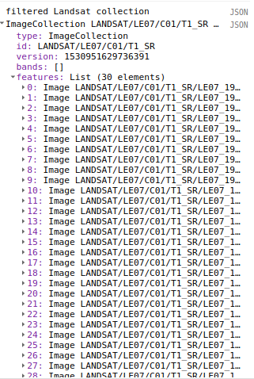
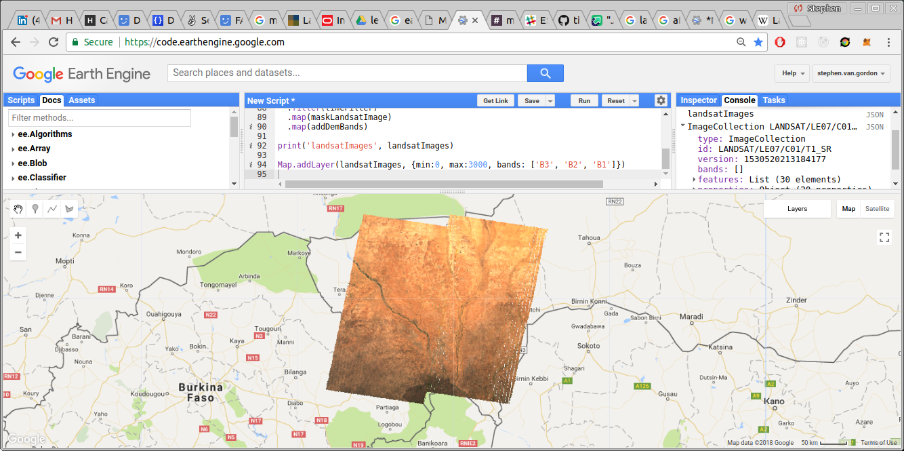

## Overview of the Atlas v2 process
Up to this point, we've discussed how to use and interact with the Atlas and Atlas V2 data. We're now going to begin to talk more about how you can use this process to produce your own land cover datasets. We will first give a rudimentary overview of the whole process, including assembling training data, sampling data, training a classifier, and classifying images. After we have gone through the whole process, we will discuss ways to improve the performance of the datasets and how to perform the process on a larger scale.

In this section, we will discuss assembling the satellite imagery that will be used to train our classifier.

## Loading a Landsat Collection
For Atlas V2, we used the Landsat 7 Surface Reflectance dataset. The images in this dataset are corrected for atmospheric conditions, so the values should more closely reflect conditions on the surface rather than the top of atmosphere. You can [read more about Landsat 7 SR here](https://explorer.earthengine.google.com/#detail/LANDSAT%2FLE07%2FC01%2FT1_SR).

We chose Landsat 7 because it has good temporal coverage, being available from 2000 to present. A disadvantage of Landsat 7 is that it suffers from the Scan-Line Off error (SLC-off). Due to a mechanical failure, after 2003 the images in Landsat 7 appear in a zig-zag patter. [You can read more about SLC-off here.](https://landsat.usgs.gov/slc-products-background) This can result in artifacts in the images.

Let's load our landsat 7 collection

var landsat7Collection = ee.ImageCollection('LANDSAT/LE07/C01/T1_SR')


## Spatial and Temporal Divisions
Due to practical constraints, we do not attempt to classify on the entire region at once. Instead, we classify one area of interest and one year at a time. Let's look how we create the geometries and the filters to select Landsat scenes.

### Areas of Interest
Let's talk a little bit about our classification zones. When we produced the Atlas V2 dataset, we split the Sahel region into a grid of 0.5° squares. We have stored a feature collection containing all of these geometries as an Earth Engine asset; you can display it as below:

```
var zoneGeometries = workshopTools.zoneGeometries
```


Dividing the study area into smaller zones was initially necessary due to limitations in Earth Engine. In earlier processes, we sampled each zone independently, and then aggregated the data. It soon became clear, however, that the classifiers performed better on small zones, rather than attempting to classify the entire region. So, our classification process works on a single zone in a single year at a time. It is possible to then aggregate the resulting classified images. We'll talk about some ways to do that later.

You'll also notice that we are not classifying the southern coast of West Africa. This is due to time constraints on our part: we just didn't have time to tweak our methods to compensate for the rainfall patterns in that region. But, there's no reason why, with a little bit of adjustment, this method wouldn't work for that region as well.

#### Selecting a zone
For this exercise, we'll classify the region around Niamey. We first need to find the ID of the zone around Niamey. Using the inspector, we can see that zone around Niamey has an ID of 789. Of course, you are free to try out different zones of your choice.

```
var aoi = zoneGeometries[789]
Map.addLayer(aoi)
```

Let's see how the Landsat collection looks after we filter it:


### Creating Time Filters

When we're assembling Landsat images for a given year, we don't take every single scene from that year. Instead, we focus on images from the early dry season, roughly mid-September to mid-November. This period has relatively cloud- and smoke-free images, and has a greater spectral difference in land cover types than later in the dry season.

In order to have enough scenes for a good sample, we select imagery from the year before and the year after the year of interest. For example, if we were creating an image for 2012, we would have imagery for September - November in 2011, 2012, and 2013.

To create the filter that selects satellite imagery based on season, we combine two functions. Don't worry too much about the way that this works: just know that you can use `getSeasons(year).get(seasonNumber)` to get a filter for `nth` season in the year. These functions are available in the workshop tools.



/*
  Given a year, return the  6 seasons for that year. Used to construct time filters.
  The slice at the end limits it to only one season; remove that (or otherwise
  adjust it) if you would like more than one season.
*/
function getSeasons(year) {
  return getFilters(getSplits(ee.Number(year)))
}

/*
  Generate 6 generic splits to be used in generate seasons
*/
function getSplits(year) {
  var startDate = ee.Date.fromYMD(year, 1, 15);
  var endDate = startDate.update(ee.Number(year).add(1));
  // var dates = [];
  var seasonLength = 60;
  var yLength = 365;

  var dates = ee.List.sequence(0, 5)
    .map(function(season) {
      var advanceLength = ee.Number(season).multiply(seasonLength)
      return startDate.advance(advanceLength, 'day')
    })
  dates = dates.add(endDate)
  return dates
}

/*
  Given a list of dates, create the filters for that season ± 1 year
*/
function getFilters(dates) {
  var startDates = dates.slice(0, -1)
  var endDates = dates.slice(1)
  var dateRanges = startDates.zip(endDates)
    .map(function(dates) {
      var startDate = ee.Date(ee.List(dates).get(0))
      var endDate = ee.Date(ee.List(dates).get(1))
      return ee.Filter.or(
        ee.Filter.date(startDate.advance(-1, 'year'), endDate.advance(-1, 'year')),
        ee.Filter.date(startDate.advance(0, 'year'), endDate.advance(0, 'year')),
        ee.Filter.date(startDate.advance(1, 'year'), endDate.advance(1, 'year'))
      )
    })
  return dateRanges
}


/**/

Let's see how things look after we apply those filters:

// Mid-September to mid-November is season 4.
var timeFilter = getSeasons(2013).get(4)

print('filtered Landsat collection', landsat7Collection.filterBounds(aoi).filter(timeFilter))



_List of landsat scenes in the AOI for the year of interest._

## Masking Satellite Images
Before we sample these landsat images, we'd like to clean up these images by masking out bad pixels. There are a lot of ways to do this, and there's a wealth of resources available on the forum. For this example, we'll use a fairly simple method: we'll use Landsat's built in quality band to filter out any clouds. Let's create a function called `maskLandsatImage()` that we'll use to map our Landsat images.

### Creating a mask

We want to mask out any bad or cloudy pixels. We're going to create that mask using the image's `pixel_qa` band.

The band `pixel_qa` is used for quality assurance. This band is produced by the CFMASK algorithm, and contains data on whether the pixel is cloud, snow, shadow, etc. This value is bit-packed: different attributes of the `pixel_qa` band are assigned to different bit positions in a binary number, which is then converted to a base-ten value.


For example, a pixel that was not `fill`, was `clear`, was `water`, was not `cloud shadow`, was not `snow`, and was not `cloud`, would be represented by `011000`, which converts to `6` (0 in the 1s place, 1 in the 2s place, 1 in the 4s place, 0 for all other values. 2 + 4 = 6.)

To unpack the `pixel_qa` values, we use a `bitwiseAnd` operation to check if two numbers have a one in the same place in their binary representations. So, to filter out any clouds, we do this:

```
// Clouds is stored in the fifth bit, so we use 2^5 as the number to check against
var cloudsValue = ee.Number(2).pow(5).int()
var cloudsMask = testImage.select('pixel_qa')
  .bitwiseAnd(cloudsValue).eq(0)
Map.addLayer(cloudsMask, {}, 'cloudsMask')
```

Let's create a function that will use the `pixel_qa` bit to create a mask for any fill pixels, clouds, shadows, or snow. We're also going to use the `radsat_qa` band to filter out pixels with one or more saturated bands. Furthermore, we only want spectral bands (not metadata bands, like `radsat_qa` or `sr_atmos_opacity`). To select only spectral bands, we'll use `.select('^B.+')`. Here, `'^B.+'` is a regular expression which will select only those bands that begin with 'B', followed by one or more characters

```
function maskLandsatImage(image) {
  // Cast the input image to an ee.Image
  image = ee.Image(image)

  // Get the pixel QA band.
  var qa = image.select('pixel_qa')

  // Bits 0, 3, 4 and 5 are fill, cloud shadow, snow, and cloud.
  var fillBit = ee.Number(2).pow(0).int()
  var cloudShadowBit = ee.Number(2).pow(3).int()
  var snowBit = ee.Number(2).pow(4).int()
  var cloudBit = ee.Number(2).pow(5).int()

  var radsat = image
    .select('radsat_qa')
    .rename('pixel_qa') // Rename from 'radsat_qa' to 'pixel_qa' so all bands have same name
    .int()

  // Put all of our masks into an image collection, and combine them
  // with .and()
  var mask = ee.ImageCollection([
    // QA Masks
    qa.bitwiseAnd(cloudShadowBit).eq(0),
    qa.bitwiseAnd(fillBit).eq(0),
    qa.bitwiseAnd(snowBit).eq(0),
    qa.bitwiseAnd(cloudBit).eq(0),
    // Radsat Mask
    radsat.eq(0)
  ]).and()
  return image
    .updateMask(mask)
    .select('B.+')
}
```


## Filtering and Aggregating our Collection

Let's load that dataset, filter it to our area of interest and our year of interest. We're going to use the `.filterBounds()` method, which takes a geometry as an argument, and returns all images in an image collection that fall within that geometry. Then we filter the collection again using the time filter. Next we remove clouds from the scenes by mapping the `maskLandsatImage` function ove the collection. Finally, we aggregate the collection into a single image by using the `.median()` call.

```
var landsatImage = landsat7Collection
  .filterBounds(aio)
  .filter(timeFilter)
  .map(maskLandsatImage)
  .median()
Map.addLayer(landsatImage, {bands: ['B3', 'B2', 'B1'], min:0, max:3000}, 'landsat 7')
print(landsatImage)
```


<br>

### Aside: Casting

Why do we need to assign testImage to itself? If we don't, you'll notice that we get a weird error message.


This error message is telling you that Earth Engine can't add that image to the map, because it can't figure out what kind of object you're trying to add. Weird!

To make this call work, we need to use *casting*. Earth Engine isn't very good at keeping track of what kind of Earth Engine object different variables are. We know that the `testImage` is an `ee.Image()`, but Earth Engine isn't sure. All Earth Engine knows is that `testImage` is the result of a `collection.first()` call, which could return a number of different data types, including `ee.Feature`, `ee.Geometry`, or even another `ee.ImageCollection` or `ee.FeatureCollection`. We'll need to explicitly tell Earth Engine that `testImage` is an `ee.Image`. We do this by passing that variable back to the constructor for that data type.

```
var testImage = niameyLandsat2013.first();
testImage = ee.Image(testImage);
displayImage(testImage, 'test image');
```

One common way to know that casting is required is if you're getting an error message where Earth Engine is telling you that an object does not have a method that you _know_ it has. For example:

```
var testImage = niameyLandsat2013.first();
print(testImage.date());
// Displays "testImage.date is not a function"
```

Over time, you'll start to get a sense of where casting is necessary. For now, don't worry too much about casting. You can just program as you would normally, and if you get errors like `variableName.functionName is not a function`, add in some casting.

<br>


Let's test our function by getting an image near the coast, getting a mask and applying it to the image using `.updateMask()`.

```
// Ziguinchor is zone 48
var coastalGeometry = zoneGeometries[48]
var landsat8Collection = ee.ImageCollection('LANDSAT/LC08/C01/T1_SR')

var testImage = landsat8Collection
  .filterBounds(coastalGeometry)
  // Use an image from May, when it's more cloudy
  .filterDate('2014-05-01', '2014-12-31')
  .first()
testImage = ee.Image(testImage)

// Add masked and unmasked images to map.
Map.addLayer(testImage, {min:0, max: 3000, bands: ['B4', 'B3', 'B2']}, 'unmasked image')
Map.addLayer(testImage.updateMask(getLandsatMask(testImage)), {min:0, max: 3000, bands: ['B4', 'B3', 'B2']}, 'masked image')
```


## Adding DEM Data

We now have a collection of Landsat images; we'd like to add the DEM data from before to those images. We do this by mapping over the image collection, adding the DEM to each image. Let's write a function to do that for us:

```
function addDemBands(image) {
  // Get the footprint of the image, which we will use to clip the DEM image
  var imageGeometry = image.geometry()
  var dem = ee.Algorithms.Terrain(ee.Image("USGS/SRTMGL1_003"))
    .clip(imageGeometry)
  return image.addBands(dem)
}
```

## Putting it all together

Let's use all of the techniques we've discussed to put together a Landsat collection. We will:

* Select an area of interest.
* Create a time filter.
* Filter a Landsat collection using the time and area filters.
* Mask those Landsat images for clouds and other bad pixels.

```
// Load Landsat 7 Collection
var landsat7Collection = ee.ImageCollection('LANDSAT/LE07/C01/T1_SR')

// Select an area of interest for Niamey
var aoi = zoneGeometries[789]

// Get time filter
var timeFilter = getSeasons(2013)

// Filter Landsat Collection
var landsatImages = landsat7Collection
  .filterBounds(aoi)
  .filter(timeFilter)
  .map(maskLandsatImage)

print('landsatImages', landsatImages)

Map.addLayer(landsatImages, {min:0, max:3000, bands: ['B3', 'B2', 'B1']})
```



Great! Now that we've put together our collection of training images, the next step is to begin sampling our data.
