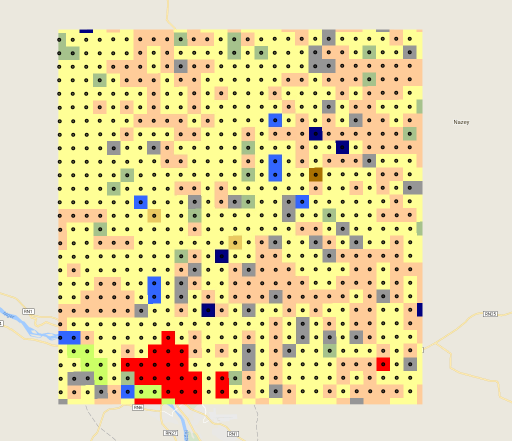

Last episode, we talked about how we can get information about areas of different classes in the AtlasV2 dataset. This episode, we will discuss more advanced statistics: specifically, we are going to look at extracting more complex information from the images, specifically information about transitions between classes.

## Transition Matrices
Because of the high temporal resolution of AtlasV2, we are able to get more meaningful information about the transitions between classes. Using AtlasV2, we can see not only that certain classes are growing or shrinking in area, but we can also see which classes are transitioning into other classes. For example, we can see that Short-grass Savanna is the class most commonly converted into agriculture.

## A more Academic Description of Transition Matrices
Transition matrices are also known as stochastic matrices. Stochastic matrices are used to describe the transitions of a Markov chain. That's basically treating the land cover system sort of like a state machine, which is actually pretty cool.

## Process Overview
To create our transition matrix, we are going to associate the image from each year in the AtlasV2 collection with the image from the year after. So we will combine the image from 2000 with the image from 2001, the image from 2001 from the image with 2002, and so forth.
~~~
[2000, 2001],
[2001, 2002],
...
[2015, 2016]
~~~
Each of these images then has information about each pixel's class in the earlier year, as well as its class in the later year. By sampling these images, we can learn whether pixels remained the same class or transitioned to different classes.

## Loading Data
To create transition matrices, we will need to load the AtlasV2 image collection.
~~~
var atlasV2Collection = ee.ImageCollection('users/svangordon/conference/atlas_v2/collections/classify')
~~~
{:. .source .language-javascript}

Let us also load two years of the data, 2013 and 2014, so that we can test out our process before applying it to the entire collection.
~~~
var atlasV2_2013 = ee.Image('users/svangordon/conference/atlas_v2/classify/2013')
var atlasV2_2014 = ee.Image('users/svangordon/conference/atlas_v2/classify/2014')
~~~
{:. .source language-javascript}

## Sampling Images
One challenge in creating a transition matrix is that the obvious method to sample an image, `.sample()` in unsuited to such a large dataset. For example, if we were to attempt to sample every single pixel in one of our AtlasV2 images at 30m scale, we would be attempting to create a feature collection with somewhere around 4e10 features. That's a big feature collection! Feature Collections are limited to a size of 80mb, so such a large sampling will fail.
~~~
print('sample', atlasV2_2013.addBands(atlasV2_2014).sample({
  scale: 30
}))
~~~
{:. .source .language-javascript}
~~~
FeatureCollection (Error)
  User memory limit exceeded.
~~~
{:. .error}

We can use the `tileScale` property to try and avoid the memory issue. `tileScale` tells Earth Engine to perform the sampling in smaller chunks ((you can read more about tile scale here)[https://developers.google.com/earth-engine/debugging#scaling-errors]). Instead of reducing regions of 256 pixels at once, Earth Engine will reduce smaller areas, which may avoid the user memory error.

~~~
print('sample, scaled', atlasV2_2013.addBands(atlasV2_2014).sample({
  scale: 30,
  tileScale: 4
}))
~~~
{:. .source .language-javascript}
~~~
FeatureCollection (Error)
  Computation timed out.
~~~
{:. .error}

However, it also makes the sampling take longer, and in this case, the sampling method times out. One option is that we could export the results of the sampling as a batch job; feature collection exports are allowed up to two hours, which might be enough time. But, it would be really convenient if we didn't have to do an export.

You may notice that the `.reduceRegion()` reduction still works. Is there a way that we can use a reduction to extract transition statistics?

## Packing Transition Values

Using raster math, we can create images where the value of each pixel reflects its class in the two years, and then take the histogram of that image.

Class values are two digit numbers (ie, integers 1 - 99). Because of this, if we multiply Year 1 by 100 and add Year 2, the values of the resulting image will be a four digit number where the first two digits represent the class in Year 1 and the second two digits represent the class in Year 2.

~~~
var packedImage = atlasV2_2013.multiply(100).add(atlasV2_2014)
var packedHistogram = packedImage.reduceRegion({
    reducer: ee.Reducer.frequencyHistogram(),
    scale: 30,
    maxPixels: 1e13
  })
print('packedHistogram', packedHistogram)
~~~
{:. .source .language-javascript}

## Getting Image Centerpoints

The Atlas is, essentially, a grid of hand classified Landsat pixels at 2km resolution. To sample it, we want to create a collection of Atlas pixel centerpoints. To do that, we're going to use the same technique as we used to create the classification zones.

First, we need to import our label image. It's important that our sampling points have the same projection as the Atlas data; we need to make sure that we're sampling exactly the pixel that was classified in the Atlas data.
~~~
var atlasImage = ee.Image('users/svangordon/conference/atlas/swa_2000lulc_2km')
var labelProjection = atlasImage.projection()
~~~
{:. .source .language-javascript}

First we create an image on random values.
~~~
var centerpoints = ee.Image
  .random()
  .multiply(100000)
  .toInt()
~~~
{:. .source .language-javascript}

Then we reduce that raster image to vectors. We pass the label projection, the classification zone, and the scale of the Atlas images.
~~~
  .reduceToVectors({
    crs: labelProjection,
    geometry: classificationZone,
    scale: 2000
  })
  .aside(function(pixelVectors) {
    Map.addLayer(pixelVectors, {}, 'vectorized Atlas pixels')
  })
~~~
{:. .code .language-javascript}

We have turned our pixels into polygons, now we want to turn our polygons into centerpoints. We map over the collection of vectors, and convert each one into its centroid.
~~~
  .map(function(feature) {
    var centroid = feature.centroid(5)
    return centroid
  })
~~~
{:. .source .language-javascript}

## Sampling Landsat Image
This Landsat image can now be sampled using the `.sampleRegions` method, similar to other images.

~~~
var landsatData = landsatImage.sampleRegions({
  collection: samplingPoints,
  scale: landsatImage.projection().nominalScale()
})
~~~
{:. .source .language-javascript}

## Adding Label Data
To include our Atlas label data, we add that image to the landsat image with:
~~~
...
  .addBands(atlasImage)
...
~~~
{:. .source .language-javascript}

## Preserving Location Data
If you try to add our data feature collection to the map, you will discover that the features don't have any kind of geometry.

~~~
print(landsatData.geometry())
~~~
{:. .source .language-javascript}
~~~
MultiPoint, 0 vertices
  type: MultiPoint
  coordinates: []
  geodesic: false
~~~
{:. .output .language-javascript}

~~~
~~~
{:. }

This means we don't know where each datapoint came from! Let's fix this.

We'll add ee.Image.pixelLonLat() to the image. This is an image where each pixel knows its own longitude and latitude.
~~~
landsatData = landsatImage
  .addBands(ee.Image.pixelLonLat())
~~~
{:. .code .language-javascript}
We'll also add the Atlas labels.
~~~
  .addBands(atlasImage)
~~~
{:. .code .language-javascript}
You can see that the features have their lon/lat coordinates as columns.
~~~
  .aside(function(collection) {
    print(collection)
  })
~~~
{:. .source .language-javascript}

Then we will map over all of the features, remove their lon/lat coordinates, and turn them into geometries.

~~~
  .map(function (feature) {
    feature = ee.Feature(feature)
    return ee.Feature(
      ee.Geometry.Point([feature.get('longitude'), feature.get('latitude')]),
      feature.toDictionary().remove(['longitude', 'latitude']))
  })
  .aside(function(collection) {
    print(collection)
  })
~~~
{:. .source .language-javascript}

<!-- ## Creating Training and Testing  -->
<br>
We now would like to get the centerpoint of each pixel in our Atlas image.The process is like this:
* Create an image of random numbers at the same scale and projection as the Atlas image.
* Convert that raster image into a collection of vectors, so that each pixel is converted to a 2km square.
* Convert each of those vectors to its centerpoint
```
function getCenterPoints(geometry, image) {
  // Get the images projection and scale.
  var crs = ee.Image(image).projection()
  var scale = crs.nominalScale()

  // Construct an image where each pixel is a random value, and we are certain
  // that no adjacent pixels have the same value. Then reduce that image to a
  // collection of polygons of size `scale`. then convert each polygon to its
  // centroid, with an error margin of 10m.
  var centerpoints = ee.Image
    .random()
    .multiply(100000)
    .toInt()
    .reduceToVectors({
      crs: crs,
      geometry: geometry,
      scale: scale
    })
    .map(function(feature) {
      var centroid = feature.centroid(10)
      return centroid
    })
  return centerpoints
}
```

Let's see how this looks:

```
var samplingPoints = getCenterPoints(aoi, atlas_2013)
print(samplingPoints)
Map.addLayer(samplingPoints)
```



Great! We now have a collection of points we can use to sample our collection of images. First, however, we will need to split these points into a training set and a validation set.

## Training and Validation Split

Before we sample our images, we want to divide our sampling points into a collection of training points (used to training the classifier) and a collection of validation points (used to assess the classifiers accuracy). It is important to assess the classifiers accuracy by testing it on datapoints it has never seen before, so that we can understand how well the classifier can be expected to perform on new images. Furthermore, we are going to split the sampling points into training and validation sets _before_ we sample, rather than sampling the images and _then_ splitting into training and validation sets, because we are sampling a collection of images, rather than a single composited image. We want to make sure that the points that we are using to assess the classifier's accuracy are points that it has never seen before.

The process of splitting a feature collection is fairly straight forward:
* Add a column containing a random number to the feature collection using `.random()`
* Use that column to split the dataset.

```
function trainTestSplit(collection, trainingSize) {

  // Add a column with a random value between 0.0 and 1.0 to each feature.
  // Provide a seed number (0) so that the results are consistent across runs.
  var withRandom = collection.randomColumn('random', 0);

  // Any features with a random value below our training size value go in training;
  // the rest go in testing.
  var trainingPartition = withRandom.filter(ee.Filter.lt('random', trainingSize));
  var testingPartition = withRandom.filter(ee.Filter.gte('random', trainingSize));
  return [trainingPartition, testingPartition]
}
```

Let's split the sampling points, and take a look at them on the map. Training points are in blue, testing points are in red.

```
var partitions = trainTestSplit(samplingPoints, 0.7)
var trainingPoints = partitions[0]
var testingPoints = partitions[1]
Map.addLayer(trainingPoints, {palette: ['blue']}, 'trainingPoints')
Map.addLayer(testingPoints, {palette: ['red']}, 'testingPoints')
```


Excellent! Now, let's sample the images that we put together before.

## Sampling images

We would now like to sample our images. For this we need:
* An image or image collection of feature images (we want the flexibility to sample collections, if we want)
* A label image (eg, the Atlas 2013 image)
* A geometry to sample (eg, a collection of sampling points)

To do this sampling, we're going to map over every feature image, add the label image, and return the result of sampling that image at the sampling points.

By default, when we sample an image, the resulting features do not have geometries. We would like to hold on to the feature geometries, so that we can know what features came from where. To do this, we will add longitude and latitude bands to our image using `ee.Image.pixelLonLat()`, and then use that information to create geometries for our features.

```
function toPoints(fc) {
  return ee.FeatureCollection(fc).map(function(f) {
    f = ee.Feature(f)
    return ee.Feature(
      ee.Geometry.Point([f.get('longitude'), f.get('latitude')]),
      f.toDictionary().remove(['longitude', 'latitude']))
  })
}

function sampleCollection(featureImages, labelImage, samplingGeometry) {
  // Cast feature images to an image collection
  featureImages = ee.ImageCollection(featureImages)

  // What scale we want to sample at. Remember, we always want to pass
  // A scale to Earth Engine. Landsat is at 30m; if we switch to a different satellite
  // dataset (for example, Sentinel) we will need to change this
  var samplingScale = 30;

  return featureImages.map(function(featureImage) {
    var datapoints = featureImage
    .addBands(labelImage)
    .addBands(ee.Image.pixelLonLat())
    .sampleRegions({
      collection: ee.FeatureCollection(samplingGeometry),
      scale: samplingScale
    })
    return toPoints(datapoints)
  }).flatten()
}
```

Let's see how this does:
```
var trainingData = sampleCollection(landsatImages, atlasV1_2013, trainingPoints)
var testingData = sampleCollection(landsatImages, atlasV1_2013, testingPoints)

print(trainingData)
print(testingData)
```

Great! We've got our training and testing data, and we're ready to train our classifier.
