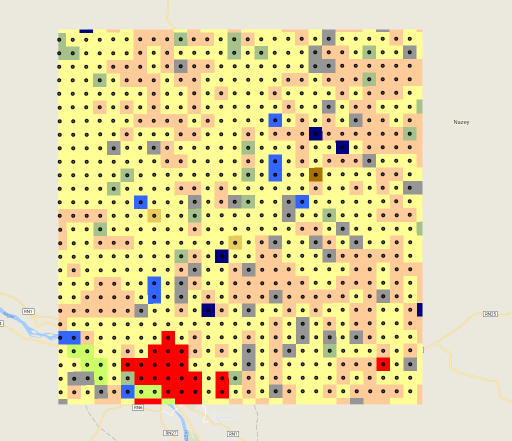
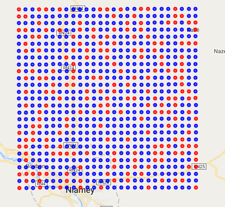

Last episode, we talked about how to assemble the training data that we're going to use to train our classifier. Now that we have this data assembled, we need to connect it with our labels, ie, the Atlas data. The Atlas data was produced by classifying individual Landsat pixels in a 2km grid. So, when we sample our Landsat images, we want to be sampling only those Landsat pixels that were used to produce the Atlas dataset. We will then add the Atlas bands to the Landsat image and sample the result, thereby creating the inputs for the classifier.

### Loading Training Image

We will use the code from the previous episode in which we created a Landsat composite image as the starting point. That code is available in Earth Engine here: bit.ly/2mmTRzu <!--http://bit.ly/2NETIUG-->

## Getting Image Centerpoints

The Atlas is, essentially, a grid of hand classified Landsat pixels at 2km resolution. To sample it, we want to create a collection of Atlas pixel centerpoints. To do that, we're going to use the same technique as we used to create the classification zones, but on a smaller scale.

First, we need to import our label image. It's important that our sampling points have the same projection as the Atlas data; we need to make sure that we're sampling exactly the pixel that was classified in the Atlas data.
~~~
var atlasImage = ee.Image('users/svangordon/conference/atlas/swa_2000lulc_2km')
var labelProjection = atlasImage.projection()
~~~
{:. .source .language-javascript}

First we create an image on random values.
~~~
var centerpoints = ee.Image
  .random()
  .multiply(100000)
  .toInt()
~~~
{:. .source .language-javascript}

Then we reduce that raster image to vectors. We pass the label projection, the classification zone, and the scale of the Atlas images.
~~~
  .reduceToVectors({
    crs: labelProjection,
    geometry: classificationZone,
    scale: 2000
  })
  .aside(function(pixelVectors) {
    Map.addLayer(pixelVectors, {}, 'vectorized Atlas pixels')
  })
~~~
{:. .code .language-javascript}

We have turned our pixels into polygons, now we want to turn our polygons into centerpoints. We map over the collection of vectors, and convert each one into its centroid.
~~~
  .map(function(feature) {
    var centroid = feature.centroid(5)
    return centroid
  })
~~~
{:. .source .language-javascript}

## Sampling Landsat Image
This Landsat image can now be sampled using the `.sampleRegions` method, similar to other images.

~~~
var landsatData = landsatImage.sampleRegions({
  collection: samplingPoints,
  scale: landsatImage.projection().nominalScale()
})
~~~
{:. .source .language-javascript}

## Adding Label Data
To include our Atlas label data, we add that image to the landsat image with:
~~~
...
  .addBands(atlasImage)
...
~~~
{:. .source .language-javascript}

## Preserving Location Data
If you try to add our data feature collection to the map, you will discover that the features don't have any kind of geometry.

~~~
print(landsatData.geometry())
~~~
{:. .source .language-javascript}
~~~
MultiPoint, 0 vertices
  type: MultiPoint
  coordinates: []
  geodesic: false
~~~
{:. .output .language-javascript}

~~~
~~~
{:. }

This means we don't know where each datapoint came from! Let's fix this.

We'll add ee.Image.pixelLonLat() to the image. This is an image where each pixel knows its own longitude and latitude.
~~~
landsatData = landsatImage
  .addBands(ee.Image.pixelLonLat())
~~~
{:. .code .language-javascript}
We'll also add the Atlas labels.
~~~
  .addBands(atlasImage)
~~~
{:. .code .language-javascript}
You can see that the features have their lon/lat coordinates as columns.
~~~
  .aside(function(collection) {
    print(collection)
  })
~~~
{:. .source .language-javascript}

Then we will map over all of the features, remove their lon/lat coordinates, and turn them into geometries.

~~~
  .map(function (feature) {
    feature = ee.Feature(feature)
    return ee.Feature(
      ee.Geometry.Point([feature.get('longitude'), feature.get('latitude')]),
      feature.toDictionary().remove(['longitude', 'latitude']))
  })
  .aside(function(collection) {
    print(collection)
  })
~~~
{:. .source .language-javascript}

<!-- ## Creating Training and Testing  -->
<br>
We now would like to get the centerpoint of each pixel in our Atlas image.The process is like this:
* Create an image of random numbers at the same scale and projection as the Atlas image.
* Convert that raster image into a collection of vectors, so that each pixel is converted to a 2km square.
* Convert each of those vectors to its centerpoint
```
function getCenterPoints(geometry, image) {
  // Get the images projection and scale.
  var crs = ee.Image(image).projection()
  var scale = crs.nominalScale()

  // Construct an image where each pixel is a random value, and we are certain
  // that no adjacent pixels have the same value. Then reduce that image to a
  // collection of polygons of size `scale`. then convert each polygon to its
  // centroid, with an error margin of 10m.
  var centerpoints = ee.Image
    .random()
    .multiply(100000)
    .toInt()
    .reduceToVectors({
      crs: crs,
      geometry: geometry,
      scale: scale
    })
    .map(function(feature) {
      var centroid = feature.centroid(10)
      return centroid
    })
  return centerpoints
}
```

Let's see how this looks:

```
var samplingPoints = getCenterPoints(aoi, atlas_2013)
print(samplingPoints)
Map.addLayer(samplingPoints)
```



Great! We now have a collection of points we can use to sample our collection of images. First, however, we will need to split these points into a training set and a validation set.

## Training and Validation Split

Before we sample our images, we want to divide our sampling points into a collection of training points (used to training the classifier) and a collection of validation points (used to assess the classifiers accuracy). It is important to assess the classifiers accuracy by testing it on datapoints it has never seen before, so that we can understand how well the classifier can be expected to perform on new images. Furthermore, we are going to split the sampling points into training and validation sets _before_ we sample, rather than sampling the images and _then_ splitting into training and validation sets, because we are sampling a collection of images, rather than a single composited image. We want to make sure that the points that we are using to assess the classifier's accuracy are points that it has never seen before.

The process of splitting a feature collection is fairly straight forward:
* Add a column containing a random number to the feature collection using `.random()`
* Use that column to split the dataset.

```
function trainTestSplit(collection, trainingSize) {

  // Add a column with a random value between 0.0 and 1.0 to each feature.
  // Provide a seed number (0) so that the results are consistent across runs.
  var withRandom = collection.randomColumn('random', 0);

  // Any features with a random value below our training size value go in training;
  // the rest go in testing.
  var trainingPartition = withRandom.filter(ee.Filter.lt('random', trainingSize));
  var testingPartition = withRandom.filter(ee.Filter.gte('random', trainingSize));
  return [trainingPartition, testingPartition]
}
```

Let's split the sampling points, and take a look at them on the map. Training points are in blue, testing points are in red.

```
var partitions = trainTestSplit(samplingPoints, 0.7)
var trainingPoints = partitions[0]
var testingPoints = partitions[1]
Map.addLayer(trainingPoints, {palette: ['blue']}, 'trainingPoints')
Map.addLayer(testingPoints, {palette: ['red']}, 'testingPoints')
```


Excellent! Now, let's sample the images that we put together before.

## Sampling images

We would now like to sample our images. For this we need:
* An image or image collection of feature images (we want the flexibility to sample collections, if we want)
* A label image (eg, the Atlas 2013 image)
* A geometry to sample (eg, a collection of sampling points)

To do this sampling, we're going to map over every feature image, add the label image, and return the result of sampling that image at the sampling points.

By default, when we sample an image, the resulting features do not have geometries. We would like to hold on to the feature geometries, so that we can know what features came from where. To do this, we will add longitude and latitude bands to our image using `ee.Image.pixelLonLat()`, and then use that information to create geometries for our features.

```
function toPoints(fc) {
  return ee.FeatureCollection(fc).map(function(f) {
    f = ee.Feature(f)
    return ee.Feature(
      ee.Geometry.Point([f.get('longitude'), f.get('latitude')]),
      f.toDictionary().remove(['longitude', 'latitude']))
  })
}

function sampleCollection(featureImages, labelImage, samplingGeometry) {
  // Cast feature images to an image collection
  featureImages = ee.ImageCollection(featureImages)

  // What scale we want to sample at. Remember, we always want to pass
  // A scale to Earth Engine. Landsat is at 30m; if we switch to a different satellite
  // dataset (for example, Sentinel) we will need to change this
  var samplingScale = 30;

  return featureImages.map(function(featureImage) {
    var datapoints = featureImage
    .addBands(labelImage)
    .addBands(ee.Image.pixelLonLat())
    .sampleRegions({
      collection: ee.FeatureCollection(samplingGeometry),
      scale: samplingScale
    })
    return toPoints(datapoints)
  }).flatten()
}
```

Let's see how this does:
```
var trainingData = sampleCollection(landsatImages, atlasV1_2013, trainingPoints)
var testingData = sampleCollection(landsatImages, atlasV1_2013, testingPoints)

print(trainingData)
print(testingData)
```

Great! We've got our training and testing data, and we're ready to train our classifier.
