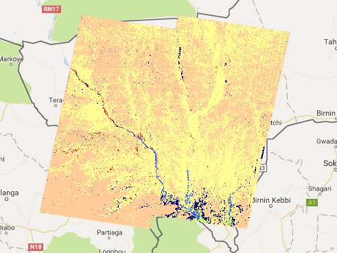
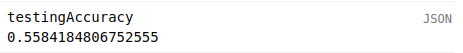
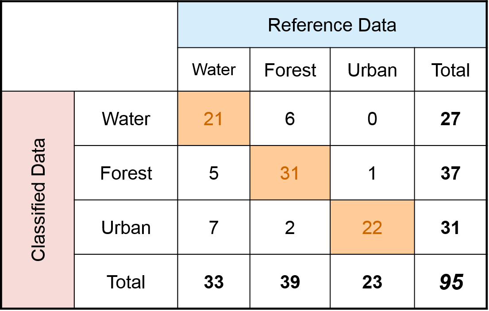

## Classifiers Overview

We're ready to start classifying!

We'll pick up where we left off last episode. You can access that code here: [http://bit.ly/2NKK5Ub]().

First, we will divide our data into a training set and testing set. Then we will train our classifier and assess its performance. Finally we'll classify and display a Landsat image.

## Training and Testing Split

Before we train our classifier, we want to divide our data into a collection of training points (used for training the classifier) and a collection of validation points (used to assess the classifier's accuracy). It is important to assess the classifiers accuracy by testing it on datapoints it has never seen before, so that we can understand how well the classifier can be expected to perform on new images.

To split the dataset, we are going to add a column with a random value to the features in our collection, and then we will use that value to split the collections. Picking up from where we left off last lesson:

~~~
landsatData = landsatImage
  .addBands(ee.Image.pixelLonLat())
  .addBands(atlasImage)
  .aside(function(collection) {
    print(collection)
  })
  .map(toPoint)
  .aside(function(collection) {
    print(collection)
  })
~~~
{:. .source .language-javascript}

We add use the `.randomColumn` to add a random value to every feature in the collection. `'random'` is the name of the column, and then we pass a **seed** value, `0`, to control the random numbers. This means that the collection will be split the same way if we run this code multiple times. We do this to make it easier to compare runs of our classifier.
~~~
.randomColumn('random', 0)
.aside(function(collection) {
  print('collection with random', collection.limit(5))
})
~~~
{:. .source .language-javascript}

Now we use the value for the percentage of the data we want in the training set to split the data. For example, if we want a 70/30 split (which is pretty standard), we will use `0.7`.

~~~
var trainingSize = 0.7
var trainingSet = landsatData.filter(ee.Filter.lt('random', trainingSize))
var testingSet = landsatData.filter(ee.Filter.gte('random', trainingSize))
~~~
{:. .source .language-javascript}

~~~

Let's put our training and testing points on the map.
~~~

Map.addLayer(trainingSet, {color: 'blue'}, 'Training Set')
Map.addLayer(testingSet, {color: 'red'}, 'Testing Set')
~~~
{:. .source .language-javascript}

We are now ready to start training our classifier.

## How does supervised classification work?

The Atlas V2 dataset was produced using the process of **supervised classification**. With supervised classification, we give a classifier a set of training data with labeled classes. The classifier, using different mathematical techniques, 'learns' the relationship between the training features and the labeled class. The classifier can then label new data that it has not seen before.

Supervised classifiers are implemented in Earth Engine as `ee.Classifier` objects. A number of classifiers implemented in Earth Engine, including perceptrons, support vector machines, and naive Bayes. For the Atlas V2 project, we used a **random forest** classifier. A random forest consists of a set of decision trees. The decision trees are not all allowed to learn on all of the features, forcing them to be different from one another and resulting in a more robust and accurate classifier. To make a classification, the trees all 'vote' on whether they think that a given sample belongs to a class. Classification is done in a one-vs-all manner. For every class the model has learned, the trees all vote on whether they think that the sample belongs to the class. Whichever class has the highest percentage of votes 'wins' the classification.

We chose a random forest for a number of reasons. They are a simple classifier that is quick for Earth Engine to calculate. The inputs for the random forest do not need to be normalized, as is the case for many other machine learning methods. The random forest does not need to undergo hyperparameter tuning, as is the case for Support vector machines, which can be very time consuming. Random forests are also fairly robust, and are resistant to noisy or irrelevant training features.

## Creating a Classifier

We're going to initialize a classifier, of the type `ee.Classifier`. There are a number of classifiers available in Earth Engine, including `naiveBayes`, `decisionTree`, and `svm`. For our classifier, we're going to use `randomForest`, because it does well on our data set both in terms of speed and accuracy. I would invite you to experiment with other machine learning techniques, however.

### Creating a Classifier

So, the first thing to do is to create a classifier:

Here, we're telling EE we want a random forest classifier, and we want it to have 20 trees per class. Although Earth Engine will give an error if a training takes to long or uses too many resources, generally more trees are better. Only up to a point, however. At a certain point, only better training features can improve accuracy.

Twenty trees is good for experimentation: it results in a reasonably accurate classification, but is still quick enough that we can run it in the EE playground. When you've decided on your exact methods, you will want to increase the amount of trees, and perform the classification as an export job.
~~~
var classifier = ee.Classifier.randomForest(20)
~~~
{:. .source .language-javascript}

There are a number of parameters that we can pass when we set up this classifier, but for now, the only one parameter that we're going to set is the number of trees per class. We're telling Earth Engine that we want to use 20 trees per class. With a random forest classifier, more trees results in higher accuracy (up to a point). We're only using two trees because of the limitations that Earth Engine imposes; when we export the resulting image later on we will switch to more trees.

### Training a Classifier

We train a classifier by passing it a feature collection. We describe which field is the label (ie, the class that we're trying to predict) and which fields we want to use as the features predicting that class. In this case, we're just using the Landsat spectral bands.

~~~
var trainingBands = ["B1", "B2", "B3", "B4", "B5", "B7"]
classifier = classifier.train(trainingData, 'b1', trainingBands)
~~~
{:. .source .language-javascript}

By printing the classifier, we can see a some information about it.
~~~
print(classifier)
~~~
{:. .source .language-javascript}
~~~
Classifier.train
  type: Classifier.train
  features: FeatureCollection (1 column)
  classProperty: b1
  classifier: Classifier.randomForest
  inputProperties: ["B1","B2","B3","B4","B5","B7"]
~~~
{:. .output}

### Training Accuracy

One of the things we want to know about our classifier is how well it performs on classifying the training data. It's not the most important accuracy score -- we're more interested in the classifier's performance on the validation data -- but it's useful for assessing possible over- or underfit.

~~~
var trainingAccuracy = classifier.confusionMatrix().accuracy()
print('Training Accuracy:', trainingAccuracy)
~~~
{:. .source .language-javascript}
~~~
Training Accuracy:
0.9455909943714822
~~~
{:. .output}

This is just the accuracy on the training set, however: we would not expect the classifier to have 95% accuracy on new data.

### Testing Accuracy

The real test of a classifier, however, is how well it performs on data that it has not seen before. To assess this, we will have our classifier classify our testing feature collection.

~~~
var testingAccuracy = testingData.errorMatrix('b1', 'classification').accuracy()
print('Testing Accuracy:', testingAccuracy)
~~~
{:. .source .language-javascript}
~~~
Testing Accuracy:
0.649402390438247
~~~
{:. .output}

This better reflects how we could expect the classifier to perform going forward.

### Producer's and Consumer's Accuracy

It would be helpful to get some information about how well the classifier performs on identifying different classes. To do this, we can use the **producer's accuracy** and the **consumer's accuracy**.

First, though, we will need to extract a list of the classes present in the testing data.  Our classes are not zero-based, and not continuous integers, so the confusion matrix by default thinks that there is a class for every single value between 0 and 78 (or whatever the highest class value of the zone is). We will use the list of classes in our testing data to tell the confusion matrix what classes we are interested in.

First we take an aggregate histogram of our testing data, and cast it to a dictionary.
~~~
var testingClasses = ee.Dictionary(testingData.aggregate_histogram('b1'))
~~~
{:. .source .language-javascript}

Then we take the keys of that dictionary, and map the keys to numbers. We must map the keys to numbers because the keys of a dictionary are always string. Once the classes are numbers, we will sort them into order.
~~~
  .keys()
  .map(function(classValue) {
    return ee.Number.parse(classValue)
  })
  .sort()
print('testingClasses', testingClasses)
~~~
{:. .source .language-javascript}

We now classify the testing set with the classifier to create an error matrix.
~~~
var errorMatrix = testingData.classify(classifier, 'b1', 'classification', testingClasses)
print('errorMatrix', errorMatrix)
~~~
{:. .source .language-javascript}
~~~
List (5 elements)
  0: [133,3,2,13,5]
  1: [12,0,0,2,3]
  2: [9,0,0,0,1]
  3: [19,1,0,27,0]
  4: [18,0,0,0,3]
~~~
{:. .output}
The rows represent **classified data**, ie, what the classifier thought things were. The columns represent **reference data**, ie, what the things actually were. You can [read more about error matrices here](http://gsp.humboldt.edu/olm_2015/Courses/GSP_216_Online/lesson6-2/metrics.html).

There are two statistics we can get from the error matrix: **producer's accuracy** and **consumer's accuracy**. Producer's accuracy represents how many of the training points were correctly classified. It's sort of like if you imagine that you made a map, and you wanted to know what how often your classifications were correct. Consumer's accuracy represents how many of the classifications matched their training points. It's sort of like if you were using someone else's map, and you wanted to know how sure you could be about their classification.

Let's look at how we get producer's and consumer's accuracy.

~~~
var producersAccuracy = errorMatrix.producersAccuracy()
print('producersAccuracy', producersAccuracy)

var consumersAccuracy = errorMatrix.consumersAccuracy()
print('consumersAccuracy', consumersAccuracy)
~~~
{:. .source .language-javascript}
~~~
producersAccuracy
List (5 elements)
  0: [0.8525641025641025]
  1: [0]
  2: [0]
  3: [0.574468085106383]
  4: [0.14285714285714285]

consumersAccuracy
  0: 0.6963350785340314
  1: 0
  2: 0
  3: 0.6428571428571429
  4: 0.25
~~~
{:. .output}

For readability, we can also zip those accuracies into a dictionary with the class values for keys. We convert our classes back into strings (because dictionary keys must always be strings). Then we project the producer's accuracy from a one dimensional array into a zero dimensional array, and convert it to a list. Then we zip the two together into a dictionary.
~~~
producersAccuracy = ee.Dictionary.fromLists(
  testingClasses.map(ee.Algorithms.String),
  errorMatrix.producersAccuracy().project([0]).toList()
)
print(producersAccuracy)
~~~
{:. .source language-javascript}
~~~
~~~


> ## Dictionary Keys
>
> You'll notice that the classes change order; there's nothing that we can do about that. Dictionary keys are always strings, and always in alphabetical order, so for example `11` comes before `9`).
{:. .callout}

### Classifying an Image

We have a trained classifier; let's use it to classify an image. We have our collection ofLlandsat images from earlier; let's composite that into one image by taking the `.median()` value and classify it with `.classify()`.

```
var classifiedImage = landsatImage
  .classify(classifier)

renderClassification(classifiedImage, 'classifiedImage')
```


## Exporting an Image

Now that we have our classified image, we would like to export it so that we can use it outside of Earth Engine. We can do this by exporting the image to Google Drive.

```
// Export a classified Image

Export.image.toDrive({
  image: classifiedImage,
  folder: 'classifiedLulc',
  region: aoi,
  fileNamePrefix: 'classifiedLulc2013',
  scale: 30,
  description: 'classifiedLulc2013',
  maxPixels: 1e13
});
```

Congrats! You've successfully created a land cover classification. Broadly speaking, that's more or less the process that you're going to use for just about everything: create a training set, use it to train a classifier, use that classifier to classify an image.

### Assessing Accuracy

Take a moment to switch to the Satellite base map, and look around our classified image, switching back and forth between the satellite base map and our classified image. How well does our classified image do? It seems like there are a few places that are clearly inaccurate: the south back of the city, for example, is classified as water, rather than settlement. But how can we quantitatively assess the accuracy of our classifier? We could check its accuracy on the training set, but that wouldn't tell us very much, because the classifier has already seen that data. We want to know how well it's going to do on data that it's never seen before, so we will use the testing data:

```
var errorMatrix = testingData
  .classify(classifier)
  .errorMatrix('b1', 'classification')

var testingAccuracy = errorMatrix.accuracy()

print('testingAccuracy', testingAccuracy)
```


55% accuracy: not bad, but not great. Let's break down those numbers a little bit more. One thing that we can do is look at the error matrix. The error matrix, which is a confusion matrix, is an N x N array where the rows represent the actual values and the columns represent the predicted values. [Read a little bit more about confusion matrices here](https://en.wikipedia.org/wiki/Confusion_matrix):


```
print(errorMatrix)
```

What we'd really like to do is get the accuracy per land cover class. This is called the Producer's Accuracy, which we get using `.producersAccuracy()`. We've got a little problem, however: Earth Engine's `ConfusionMatrix` expects that classes are going to be contiguous integers, but our classes are non-contiguous integers. We need a way to distinguish between classes that have 0% accuracy because the classifier failed to classify any of them correctly and classes that have 0% accuracy becase they were not present in the testing set. To do this, we're going to:
* Create a list of the land cover classes present in the testing dataset.
    * To get the list of land cover classes, we're going to:
        1. Get the `.aggregate_histogram()` of the land cover band (`'b1'`)
        1. Convert the resulting object to an `ee.Dictionary`
        1. Take the keys of that dictionary.
* Create the producer's accuracy and convert it to a list.
    * The output of `.producersAccuracy()` is a 1-dimensional array. To convert this to a list that we can work with, we will need to reproject it to a 0-dimensional array.
* Select from that list the elements that are present in the testing dataset by index.
    * The classes in the list of classes will be strings, so we need to convert them to `ee.Number`s using `ee.Number.parse()`
* Zip together the land cover class numbers and the accuracies into a dictionary.

```
// Get the classes present in the testing set
var testingClasses = testingData.aggregate_histogram('b1')
testingClasses = ee.Dictionary(testingClasses).keys()

print('testingClasses', testingClasses)

// Take the producers accuracy, and reproject it from a 1-dimensional matrix
// into 0 dimensions, and then convert it into a list.
var producersAccuracy = errorMatrix.producersAccuracy().project([0]).toList()
print('producersAccuracy', producersAccuracy)
var accuracyByClass = testingClasses.map(function(classId) {
  return producersAccuracy.get(ee.Number.parse(classId))
})

accuracyByClass = ee.Dictionary.fromLists(testingClasses, accuracyByClass)

print('accuracyByClass', accuracyByClass)
```

Now let's roll that all together into a function.

```
function getAccuracyByClass(testingData, classProperty) {
  testingData = ee.FeatureCollection(testingData)
  // Get the classes present in the testing set
  var testingClasses = testingData.aggregate_histogram(classProperty)
  testingClasses = ee.Dictionary(testingClasses).keys()

  // Take the producers accuracy, and reproject it from a one dimensional matrix
  // into 0 dimensions, and then convert it into a list.
  var producersAccuracy = errorMatrix.producersAccuracy().project([0]).toList()
  var accuracyByClass = testingClasses.map(function(classId) {
    return producersAccuracy.get(ee.Number.parse(classId))
  })

  return ee.Dictionary.fromLists(testingClasses, accuracyByClass)
}
```

<!-- # Classifying Different Years

So far we've only classified images from the same year as when the classifier was produced. But, we can classify from different years, too. So long as a dataset has data available for one of the years that Atlas was produced (1975, 2000, 2013), we can create a classifier that will work on other images from a remote sensing dataset.

For example, let's create an image for 2014, and have our classifier classify that.

```
// Load Landsat 7 Collection
var landsat7Collection = ee.ImageCollection('LANDSAT/LE07/C01/T1_SR')

// Select an area of interest for Niamey
var aoi = zoneGeometries[789]

// Get time filter
var timeFilter2014 = getEarlyDrySeason(2014)

// Filter Landsat Collection
var landsatImages2014 = landsat7Collection
  .filterBounds(aoi)
  .filter(timeFilter2014)
  .map(maskLandsatImage)

print('landsatImages', landsatImages)

Map.addLayer(landsatImages, {min:0, max:3000, bands: ['B3', 'B2', 'B1']})
``` -->


# Improving our Classifier

We've now gone through the whole process from start to finish. We can now:

* Create training inputs
* Sample training inputs
* Train a classifier
* Classify images
* Assess the performance of our classifier
