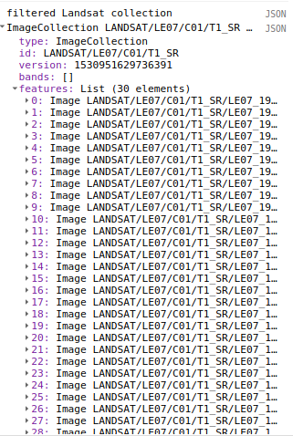

## Overview of Creating a Basemap
Up to this point, we've discussed how to use and interact with the Atlas and Atlas V2 data. We're now going to begin to talk more about how you can use this process to produce your own land cover datasets. The first step in this process is creating a basemap, from which we will extract our training data. For this, we will:
* **Select a dataset:** We need to decide what dataset of satellite imagery we will use for our basemap. In this example, we will use Landsat 7 SR.
* **Generate a classification zone:** We limit our classification to a region approximately 0.5 degrees square. We generate this geometry in Earth engine, and use it to filter the image collection of satellite data. In this example, we use an area in the Guinea Highlands.
* **Create a time filter:** We do not want to use the images from the entire year. Instead, we want to create a filter that we will use to limit our satellite dataset to times of the year when those images are best for classification (generally, when the land cover classes are the most different). In this example, we will use imagery from September to November. We will also use imagery from our year of interest, as well as the year before and the year after, in order to ensure that we have enough imagery.
* **Process input imagery:** We will use image processing to improve the quality of our input images. We will mask for clouds, etc.

We will first give a rudimentary overview of the whole process, including assembling training data, sampling data, training a classifier, and classifying images. After we have gone through the whole process, we will discuss ways to improve the performance of the datasets and how to perform the process on a larger scale.

In this section, we will discuss assembling the satellite imagery that will be used to train our classifier.

Outline of Process:
* Create centerpoints of Atlas images
* Create Landsat collection, filtered spatially and temporally
* Sample Landsat collection at centerpoints
<!-- Discussion for about 15 minutes -->

## Loading a Landsat Collection
For Atlas V2, we used the Landsat 7 Surface Reflectance dataset. The images in this dataset are corrected for atmospheric conditions, so the values should more closely reflect conditions on the surface rather than the top of atmosphere. You can [read more about Landsat 7 SR here](https://explorer.earthengine.google.com/#detail/LANDSAT%2FLE07%2FC01%2FT1_SR).

We chose Landsat 7 because it has good temporal coverage, being available from 2000 to present. A disadvantage of Landsat 7 is that it suffers from the Scan-Line Off error (SLC-off). Due to a mechanical failure, after 2003 the images in Landsat 7 appear in a zig-zag pattern. [You can read more about SLC-off here.](https://landsat.usgs.gov/slc-products-background) This can result in artifacts in the images.

Let's load our Landsat 7 collection.
~~~
var landsat7Collection = ee.ImageCollection('LANDSAT/LE07/C01/T1_SR')
~~~
{:. .source .language-javascript}

## Classification Zones

One of the surprising things we learned while making the Atlas V2 dataset was that the classification was more accurate when we trained many classifiers on small areas of the region. It's sort of like how you're better able to recognize your friends than strangers because you see your friends more often. When we produced the Atlas V2 dataset, we split the Sahel region into a grid of 0.5° squares, and did the training and classification process separately for each zone. Doing the classification on smaller zones also helps avoid timeouts or out-of-memory errors.

To generate the training zones, we use a little trick that we'll use a few times. We're going to create an raster of random values at the scale and projection that we want, and then we will reduce that raster to an collection of vectors.

We need a geometry to use to bound our classification zones. Let's use just draw a point on the map. We'll make the zones 56000m square, which is roughly 0.5 degrees.
~~~
var classificationArea = ee.Geometry.Point([-12.392578125, 12.399002919688813]);
var zoneSize = 55000
~~~
{:. .source .language-javascript}

We will also load the Atlas image, so that we can get its projection. We want our zones to be in the same projection as the Atlas image.
~~~
var atlasImage = ee.Image('users/svangordon/conference/atlas/swa_2000lulc_2km')
var labelProjection = atlasImage.projection()
~~~
{:. .source .language-javascript}

First we create an image of random floats, 0.0 - 1.0
~~~
var classificationZones = ee.Image.random()
~~~
{:. .code .language-javascript}

We then convert our floats to integers 0-10000000. No two neighboring pixels should have the same value.
~~~
  .multiply(10000000)
  .toInt()
~~~
{:. .source .language-javascript}

We now reduce our seed image to a feature collection, using the scale to set the size of the zones.
~~~
  .reduceToVectors({
      scale: zoneSize,
      geometry: classificationArea.geometry()
    })
~~~
{: .code .language-javascript}

## Creating Time Filters

When we're assembling Landsat images for a given year, we don't take every single scene from that year. Instead, we focus on images from the early dry season, roughly mid-September to mid-November. This period has relatively cloud- and smoke-free images, and has a greater spectral difference in land cover types than later in the dry season.

In order to have enough scenes for a good sample, we select imagery from the year before and the year after the year of interest. For example, if we were creating an image for 2012, we would have imagery for September - November in 2011, 2012, and 2013.

<!-- Let's create a function that creates a filter for us. We're going to create a function that takes a (eg, `2012`) and returns a filter that selects images from September 15 to November 15 for that year and the years before and after. -->

~~~
function getLateYearFilter(year) {
~~~
{:. .code .language-javascript}

To create our filters, we're going to combine filter for 2012 to 2014 using `.or`
~~~
// Create a time filter for 2013
var timeFilter = ee.Filter.or(
    ee.Filter.date('2012-09-15', '2012-11-15'),
    ee.Filter.date('2013-09-15', '2013-11-15'),
    ee.Filter.date('2014-09-15', '2014-11-15')
  )
print(timeFilter)
~~~
{:. .code .language-javascript}

Let's apply those filters to the Landsat collection.
~~~
landsat7Collection
  .filterBounds(classificationZones)
  .filter(getLateYearFilter(2010))
  .aside(function(collection) {
      Map.addLayer(collection, {min: 0, max:3000, bands: "B3, B2, B1"})
  })
~~~
{:. .source .language-javascript}

_List of landsat scenes in the AOI for the year of interest._

## Masking Satellite Images
Some of these Landsat scenes are pretty cloudy. Before we can use them for our classifier, we would like to clean up the clouds. Landsat images have a `pixel_qa` band that contains information about whether a band is likely to be a cloud, a fill pixel, a shadow, etc. It also contains a `radsat_qa`, which will be equal to 0 if no bands are saturated.

`pixel_qa` is bit packed, meaning that its a number of boolean variables (ie, 0 or 1) that are put in a list and converted into a base 10 integer. For example, say we were storing information about three different properties. The first bit is in the `2 ** 0` (1) place, the second bit is in the `2 ** 1` (2) place, the third bit is in the `2 ** 2` (4) place. If we wanted to store information where the first two properties were present and the third was not, it would be bit packed like this:
~~~
bit1 = 1
bit2 = 1
bit3 = 0
=>
[0, 1, 1] => [0, 2, 1] => 3
~~~
{:. .output}
> ## Why are these numbers right to left?
>
> That's just the way that binary is.

Let's create a function that can mask landsat images for clouds.
~~~
function maskLandsat(image) {
~~~
{:. .code .language-javascript}

We're going to set up the numbers that we'll use to check against the `pixel_qa` band.
~~~
  var qa = image.select('pixel_qa')

  // Bits 0, 3, 4 and 5 are fill, cloud shadow, snow, and cloud.
  var fillBit = ee.Number(2).pow(0).int()
  var cloudShadowBit = ee.Number(2).pow(3).int()
  var snowBit = ee.Number(2).pow(4).int()
  var cloudBit = ee.Number(2).pow(5).int()
~~~
{:. .source .language-javascript}

We also want to check the `radsat_qa`. Let's create a mask that masks out pixels with saturated bands.
~~~
  var radsatMask = image
    .select('radsat_qa')
    .eq(0)
~~~
{:. .source .language-javascript}

We combine that radsat mask with a bitwise mask for each of the different `pixel_qa` maps that we're checking.
~~~
  // Put all of our masks together with an and, checking if the numbers
  // the numbers have the same values in the same places.
  var mask = radsatMask
    .and(qa.bitwiseAnd(cloudShadowBit).eq(0))
    .and(qa.bitwiseAnd(fillBit).eq(0),
    .and(qa.bitwiseAnd(snowBit).eq(0))
    .and(qa.bitwiseAnd(cloudBit).eq(0))
~~~
{:. .source .language-javascript}

~~~
  return image
    .updateMask(mask)
~~~
{:. .source .language-javascript}
~~~
We now want to drop any of the metadata bands from the image (`pixel_qa`, `radsat_qa`, etc)
~~~
    .select(['B1', 'B2', 'B3', 'B4', 'B5', 'B7'])
}
~~~
{:. .source .language-javascript}

Let's see how well our mask does.

~~~
var landsatImage = landsat7Collection
  .filterBounds(classificationZone)
  .filter(timeFilter)
  .map(maskLandsat)
  .median()

Map.addLayer(landsatImage, {min: 0, max: 3000, bands: "B3, B2, B1"})
~~~
{:. .source .language-javascript}

/*Code available at bit.ly/2uCzfHj*/
