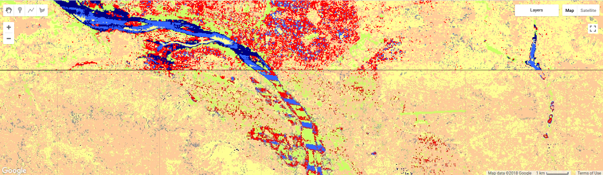
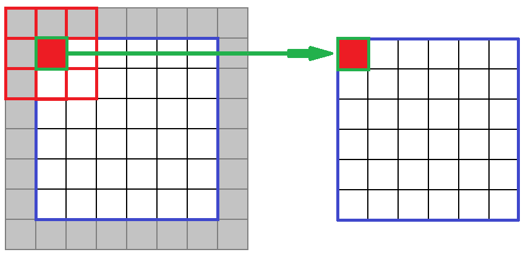
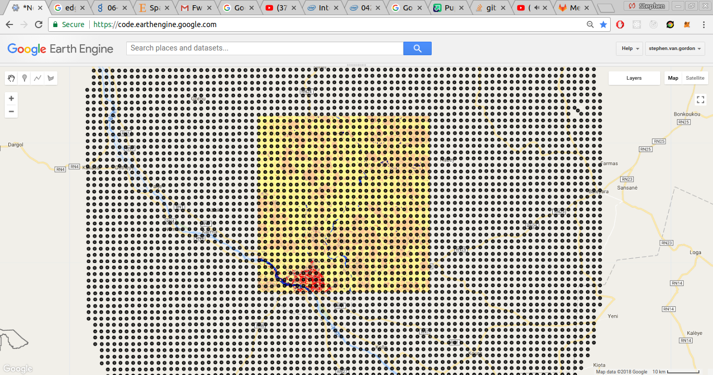
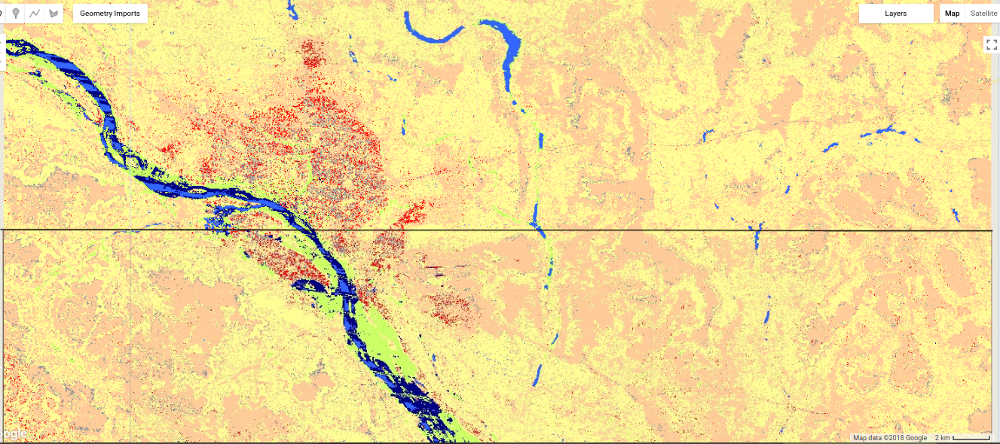

## Including Neighboring Zones

At this point, we're using a series of classifiers to classify a series of zones. One pitfall with this  method is that there can be discrepencies between two zones. One class might be missing from the training data in a zone, or it might not be present in sufficient numbers for the classifier to be able to learn that class well enough for it to be able classify that class.

You can see an example of the boundary issue in the image below: there is a clear difference in how the classifier on the right and the classifier on the left are classifying the agriculture vs savanna.


This is the down side of using the zone system: our classifiers are more accurate, but they are less able to generalize. However, it is possible for us to 'smooth' these zone boundaries. By sampling the zones around the zone we seek to classify, we can get a more balanced training set, and a more versatile classifier, without a loss in accuracy. Let's look at how we can do this.

First, let's demonstrate the zone boundary issue. We're going to classify the zone next to our area of interest, and look to see if there's a noticeable border between the two zones. First, let's get a zone that neighbors our AOI.

## Setting up Baseline Again


~~~
/*
  Including neighboring zones
*/

var neighborZonePoint = /* color: #d63000 */ee.Geometry.Point([-12.444763162638992, 12.427175804835738]);
var neighborZone = ee.Image.random()
  .multiply(10000000)
  .toInt()
  .reduceToVectors({
    crs: atlasImage.projection(),
    scale: zoneSize,
    geometry: neighborZonePoint
  });

var neighborImage = landsat7Collection
  .filterBounds(neighborZone)
  .filter(getLateYearFilter(2013))
  .map(maskLandsat)
  .median()
  .addBands(atlasImage)
  .clip(neighborZone)

var neighborPoints = ee.Image
  .random()
  .multiply(100000)
  .toInt()
  .reduceToVectors({
    crs: labelProjection,
    geometry: neighborZone,
    scale: labelProjection.nominalScale()
  })
  .map(function(feature) {
    var centroid = feature.centroid(5)
    return centroid
  })

Map.addLayer(neighborZone, {}, 'neighborZone')
assessClassification(neighborImage, neighborPoints, landsatBands, 'neighbor classification')
~~~
{:. .source .language-javascript}
<!--  -->

In the Kedougou example, you can see that the neighbor classification is doing much better. Part of the reason for this is the boundary issue. There is a river that runs through these two zones, but the river only intersected with the sampling points in the northern zone. As a result, the `water` class is missing from the southern zone. As a result, there's a noticeable difference in the the images are classified in the two zones. To smooth the boundaries between the zones, we're going to sample data from outside of our zone as well as inside. This is similar to a 'kernel' in image processing:



<!-- We would also like to oversample minority classes, so that there is an even number of all of the training classes present... -->

Our process is going to be as follows:

* Generate the sampling points for the AOI as normal.
* Expand the AOI so that it encompasses all neighboring zones, and generate its sampling points.
* Sample from the expanded area, so that we have a new set of training points that is 50% in the original AOI, and 50% in the neighboring zones.

We have the sampling points from our AOI (`samplingPoints`). Let's get our neighboring sampling points. First, we need to expand our AOI so that it encompasses all neighbor zones. We're going to do this using `.buffer()`. `.buffer()` takes a geometry and expands it by a distance in meters (or shrinks it if the distance is negative). We want to expand our zone by the size of the zone.

~~~
var expandedZone = classificationZone.buffer(zoneSize)
Map.addLayer(expandedZone, {}, 'expanded zone')
~~~
{:. .source .language-javascript}


We can now create sampling points for this zone as we did for the other zones. We only want sampling points for pixels that are outside of our original zone. So, we can use the `.difference()` method to subtract the original zone from the expanded zone, and only get the resulting centerpoints.
~~~
var expandedPoints = getPoints(expandedZone.difference(zoneGeometry))
Map.addLayer(expandedPoints, {color: 'green'}, 'expanded points')
~~~
{:. .source .language-javascript}

We want to create sampling and testing points for the zone itself as we would normally. We don't want to take every single training point inside of our buffered geometry, or the ratio of training points inside the zone to training points outside of the zone would be around 8:1, and signal from outside of the zone would overwhelm signal from inside of the zone.

~~~
var imageData = trainingImage
  .addBands(ee.Image.pixelLonLat())
  .sampleRegions({
    collection: samplingPoints,
    scale: 30
  })
  .map(toPoint)
  .randomColumn('random', 0)
~~~
{:. .source .language-javascript}

```
var bufferedAoi = niameyAoi.buffer(bufferDistance)
var neighborPoints = getCenterPoints(bufferedAoi, atlasV1_2013)
Map.addLayer(neighborPoints)
```

With the expanded AOI, we generate a feature collection of sampling points, as we do normally. We then randomly select as many points from that collection as there are points in the AOI. We then filter out any points that fall within the original AOI.

This is an important filter! We need to make sure that there aren't any testing points that fall within both the training set and the testing set. When testing data is available in the training data, it is called *leakage*. That's bad! Leakage is when your model has access to data that it shouldn't. In this case, the model is getting to peek at some of the validation data. When we actually try to create new land cover maps, the model won't be able to peek at anything: all of the data will be unknown. Leakage results in artificially high estimate of the classifier's accuracy: you think that the classifier is doing well, because it's 'cheating', but when exposed to real data, it will perform poorly.



```
var bufferedPoints = getCenterPoints(bufferedAoi, atlasV1_2013)
  // Add a random column
  .randomColumn()
  // Select as many points from the neighbor points as there are points in the AOI, sorted randomly
  .limit(samplingPoints.size(), 'random')
  // Drop all columns from the sampling points, thereby discarding the random column
  .select([])
Map.addLayer(bufferedPoints)
```

We then sample these points and add them to our training data. We don't include these points in the feature collection that we split into the training and testing data, because we only care how well the classifier does at classifying our AOI.

```
// Sample our landsat image at the neighborPoints
var bufferedData = sampleCollection(ee.ImageCollection(landsatImage), atlasV1_2013, bufferedPoints)
```
Finally, we merge the neighbor data with the training data, and proceed with the classification process as normal.

```
// Merge neighborPoints with the training points from the AOI
bufferedData = bufferedData.merge(trainingData)
```
```
/*
...
*/
```

How do our results look? Looking good. It looks like the zone boundary has been significantly reduced.


We also get a pretty hefty bump in accuracy:


Which is great!

## Review
We've explored a number of ways that we can improve the quality of our inputs. We looked into adding new features, either by including new datasets or by creating new features out of existing features. We looked into increasing the number of samples available in the training data by sampling multiple satellite images for a single datapoint. And finally we looked at smoothing the boundaries between zones by sampling data from the zones adjacent to our area of interest.
