## Overview

At this point, we've gone through the entire process for the production of a land cover dataset: creating a training set; connecting the training images to ground truth data; sampling the training data; training a classifier; assessing its accuracy; classifying and exporting an image.

We would now like to look into steps to improve the performance of our classification. To improve our the quality of our classification, there are a couple of steps that we can take:
* Adding new features to the training data by including new datasets, such as precipitation or elevation
* Creating new features from existing features, such as Normalized Difference Vegetation Index (NDVI)
* Including training data from more than one season
* Reducing classification discrepancies between zones by including training data from more than one zone

### A note of classification accuracy
The easiest way to improve a classifier's accuracy, generally speaking, is to give it more resources. The more memory a classifier can use, and the longer it can run its training routine, the better it is going to perform. However, Earth Engine has some hard limits on how long certain processes can take, especially when it comes to displaying things in the console. We just want to test out how different inputs perform, so we're using a less powerful classifier than we would otherwise. The random forest classifier that we're using in this unit only has 2 trees per class; when we decide on our method and export images later on, we will be using 10 or 20 trees per class.

So, some of the classifications in the example will look 'bad'. The classifications will improve when we throw more resources at them later. For now, we're just comparing inputs.

## Benchmark classification

Let us use the tools from the workshop to train and assess a classifier. We can use this classification accuracy as our benchmark. If a sampling method is more accurate than this classification, then we are improving the quality of the inputs.

We're going to use the area around Niamey as our area of interest. Feel free to set `classificationAoi` to a different zone, or to draw your own geometry for classification

```
// Load tools from our workshop tools
var workshopTools = require('users/svangordon/lulc-conference:workshopTools')
var maskLandsatImage = workshopTools.maskLandsatImage
var getEarlyDrySeason = workshopTools.getEarlyDrySeason
var atlasV1_2013 = workshopTools.atlasV1_2013
var getCenterPoints = workshopTools.getCenterPoints
var trainTestSplit = workshopTools.trainTestSplit
var sampleCollection = workshopTools.sampleCollection
var assessClassification = workshopTools.assessClassification
var getSeasons = workshopTools.getSeasons

var landsat7Collection = ee.ImageCollection('LANDSAT/LE07/C01/T1_SR')

// Load Niamey AOI
var zoneGeometries = workshopTools.zoneGeometries
var niameyAoi = zoneGeometries[789]

// Create the time filter for 2013
var earlyDrySeasonFilter2013 = getEarlyDrySeason(2013)

// Create our Landsat testing collection
var landsatImage = landsat7Collection
  .filterBounds(niameyAoi)
  .filter(earlyDrySeasonFilter2013)
  .map(maskLandsatImage)
  .median()

// Assemble 2013 data and use it to train a classifier
var samplingPoints = getCenterPoints(niameyAoi, atlasV1_2013)
var partitions = trainTestSplit(samplingPoints, 0.7)
var trainingData = sampleCollection(ee.ImageCollection(landsatImage), atlasV1_2013, partitions[0])
var testingData = sampleCollection(ee.ImageCollection(landsatImage), atlasV1_2013, partitions[1])

var classifier = ee.Classifier.randomForest(2)
  .train(trainingData, 'b1', ['B1', 'B2', 'B3', 'B4', 'B5', 'B7'])

// print(assessClassification(testingData, classifier, 'b1'))
print('accuracy', testingData.classify(classifier).errorMatrix('b1', 'classifier').accuracy())
```

So, we're hitting 55% accuracy. Let's look at a few ways to increase our accuracy.

## Adding New Features

### On signal and noise

One way to increase accuracy is to add additional features by including new datasets. This gives the classifier more information to use to make its decision. What we're trying to do here is to add as much 'signal' as we can: we're trying to increase the amount of useful information that is going in to the classifier. It can be tempting to use all the data you can find. We need to be a little bit careful when deciding what features we add: We don't want to add features that don't predict our ground truth label. Imagine the worst case scenario: adding a feature to an image that is absolute random noise.

~~~
/*
  Do a noisey classification
*/

var noiseyImage = landsatImage.addBands(ee.Image.random()).addBands(ee.Image.random()).addBands(ee.Image.random())
  .clip(classificationZone)
var noiseyBands = landsatBands.cat(['random', 'random_1', 'random_2'])
~~~
{:. .source .language-javascript}

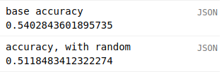

<!-- Not surprisingly, adding random information doesn't improve our classifier. We wouldn't intentionally add random noise to our classifier, but we have to be careful not to do so unintentionally: we might add a dataset that's not related or only weakly related to the label that we're trying to predict, or we might add a dataset that is highly noisey (such as satellite imaging that has not been properly cleaned and contains many cloudy images). Similarly, improving the signal-to-noise ratio of our data, for example by better masking out clouds or by better correcting for atmospheric interference, will result in better results. -->

Weirdly, this actually *increases* accuracy. My only theory for why is that adding a bunch of random values functions like a drop-out node in a neural net. I don't know. Drop this because "add random numbers to your training data" isn't a great takeaway.

### Curse of dimensionality

There's another factor at work here, something called *the curse of dimensionality* or [Le fléau de la dimension](https://fr.wikipedia.org/wiki/Fl%C3%A9au_de_la_dimension). As we add more features, more samples are necessary for our model to learn about the relations between those features. For a set sample size, adding new features will increase accuracy up to a point, and then begin to decrease accuracy.

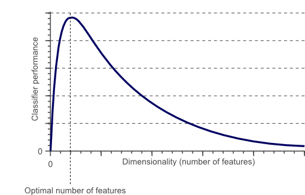

Practically, this means that you can't just add more and more features to the training dataset: at some point adding new features will actually decrease accuracy. At that point, you'll have to begin removing some features, for example by removing features that do not do a good job predicting the ground truth class, by removing features that are highly correlated, or by combining features. How will you know that you have too many features in your data? In general, the more correlated the features are, the more samples are necessary to learn their relationships. Practically, however, the best way to determine if your model has too many features is through experimentation. Add some features, check the accuracy; remove some features, check the accuracy; change the features around, check the accuracy, etc.

## Adding Elevation Data

Let's go ahead and add a dataset of elevation to our features. We're going to use [SRTM Digital Elevation Data 30m](https://explorer.earthengine.google.com/#detail/USGS%2FSRTMGL1_003). This is a set of 30m data where each pixel represents the height in meters above sea level. Earth Engine also contains some methods to calculate additional information from elevation data. The `ee.Algorithms.Terrain` method uses the 4 pixels surrounding each pixel to calculate:
* Slope
* Aspect
* Hillshade

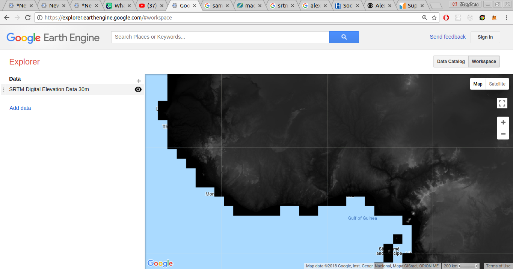


```
var demData = ee.Image("USGS/SRTMGL1_003")
var demImage = landsatImage.addBands(ee.Algorithms.Terrain(demData)).clip(classificationZone)
var demBands = landsatBands.cat(['elevation', 'slope', 'aspect', 'hillshade'])

assessClassification(demImage, samplingPoints, demBands, 'dem classification')
```
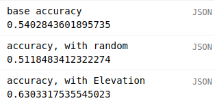

Other bands available include `'aspect'`, '`'slope'`', and '`hillshade`'. How do different combinations of terrain bands change the classifier output?

### Adding precipitation data

Next, let's try adding precipitation data. A range of meteorological and climactic datasets are available on Earth Engine; for this exercise we're going to use the [CHIRPS precipitation dataset](https://explorer.earthengine.google.com/#detail/UCSB-CHG%2FCHIRPS%2FDAILY). This dataset provides global daily precipitation data at 0.05° resolution.

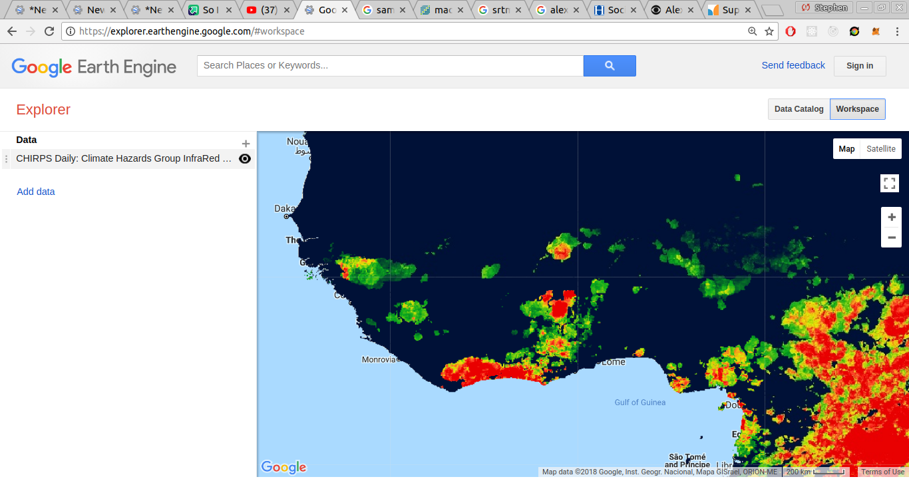

What we'd like to do is to filter the image collection to the early dry season and reduce it to a single image (we'll do `.sum()`, but you might try experimenting with other reducers like `.mean()` or `.median()`). However, you might have already noticed one issue: the CHIRPS data is at a much coarser resolution than the Landsat and Atlas data (0.5° vs 30m). This can cause problems; we need to figure out a way to address these differences in resolution so that we don't introduce artifacts into our classification. We're going to use a method known as `resampling`.

### Resampling
Resampling is a way of projecting raster data from a coarser resolution to a finer resolution. In resampling, each pixel at the finer resolution is given a value that is calculated from its pixel at the higher resolution, as well as that pixels neighbors, with the input pixels given different weights based on their distance to the output pixel. You can [read more about it in Earth Engine here](https://developers.google.com/earth-engine/resample#resampling), and [read about resampling more generally and see some examples here](https://en.wikipedia.org/wiki/Image_scaling).

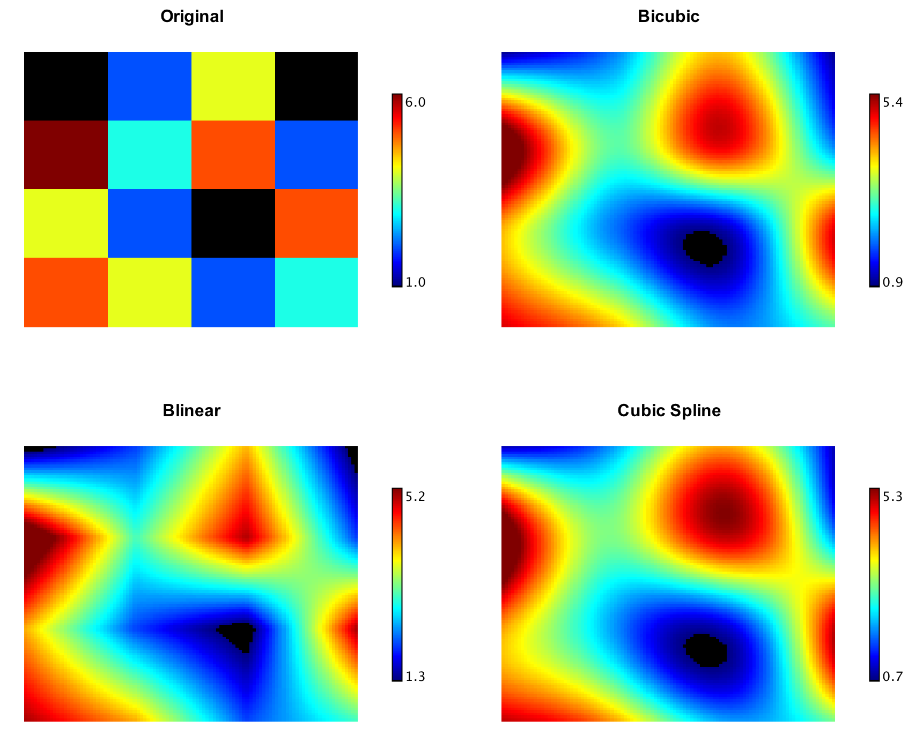

When we resample images in Earth Engine, we use the `.resample(samplingMethod)` method. All we do is tell Earth Engine that we want to resample an image, and tell it what resampling method we want to use. Then, when Earth Engine needs to rescale or reproject an image, it will do so using that method (instead of the nearest neighbors method, which is the default). Two resampling methods are available: `'bilinear'` and `'bicubic'`. `'bilinear'` is more appropriate for precipitation data, so we'll use this one, but as always experimentation is important.

Another important note: if you are going to aggregate an image collection, you must resample before you aggregate, not after. For example, with our precipitation collection, we want to take a collection of CHIRPS images, resample them all, and then aggregate. If we aggregate the collection and then resample it, because of the implicit reprojection in the aggregation technique, the resampling will not work. (Don't worry about the specific reason; just know that you have to resample and then aggregate). In fact, as you can see, the accuracy actually suffers.

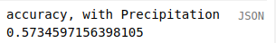
Unresampled Image
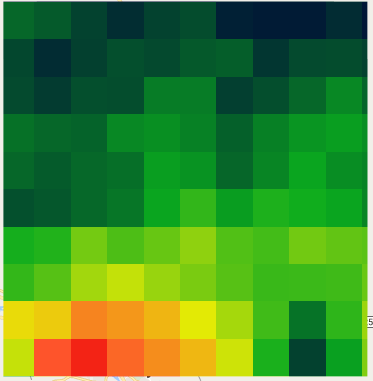
Accuracy: 57.3%

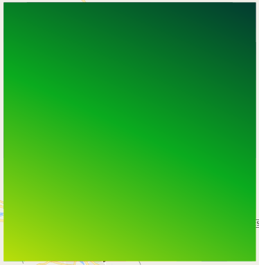
Resampled after Aggregation
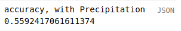
Accuracy: 55.9%


Resampled after Aggregation

Accuracy: 55.9%


Resampled before Aggregation
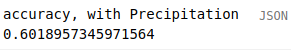
Accuracy: 60.1%

To resample the images in a collection before we aggregate them, we use a `.map()` call, as you will see.

```
/*
  Add CHIRPS precipitation data
*/
var chirpsData = ee.ImageCollection("UCSB-CHG/CHIRPS/DAILY")
  .filterDate('2013-01-01', '2013-12-31')
  // Resample all images in the collection. Try commenting out the next line
  .map(function(image) {return image.resample('bilinear')})
  .sum()
  .clip(niameyAoi)

var chirpsVis = {min:400, max: 600, palette: ['001137','0aab1e','e7eb05','ff4a2d','e90000']}
Map.addLayer(chirpsData, chirpsVis, 'Precipitation Data')

var landsatWithPrecipitation = landsatImage.addBands(chirpsData)
var trainingDataWithPrecipitation = sampleCollection(landsatWithPrecipitation, atlasV1_2013, partitions[0])
var testingDataWithPrecipitation = sampleCollection(landsatWithPrecipitation, atlasV1_2013, partitions[1])
var classifierWithPrecipitation = baseClassifier
  .train(trainingDataWithPrecipitation, 'b1', ['B1', 'B2', 'B3', 'B4', 'B5', 'B7', 'precipitation'])

print('accuracy, with Precipitation', testingDataWithPrecipitation.classify(classifierWithPrecipitation).errorMatrix('b1', 'classification').accuracy())
renderClassification(landsatWithPrecipitation.classify(classifierWithPrecipitation), 'with precipitation')
```
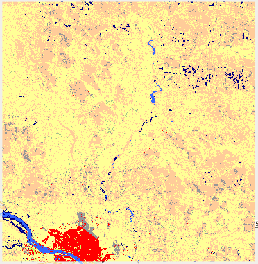

## Spectral Indices

So far, we've looked at adding new datasets. However, it's possible for us to create new features from the ones that we already have, as a way to represent relationships between our features. One of the obvious ways to do this is using spectral indices like Normalized Difference Vegetation Index (NDVI) and Normalized Burn Ratio (NBR). [You can read more about spectral indices here](https://landsat.usgs.gov/sites/default/files/documents/si_product_guide.pdf).

### NDVI
The Normalized Difference Vegetation Index is a way of representing the greenness of a pixel. It is the difference of the near-infrared band and the red band divided by the sum of the near-infrared band and the red band.

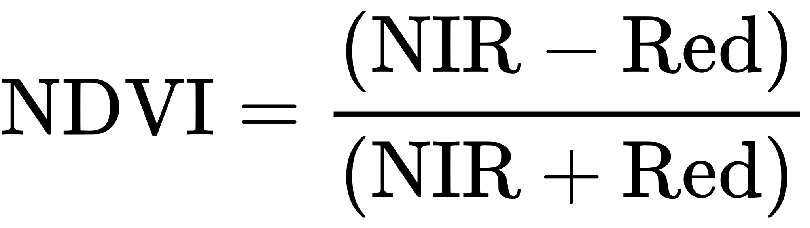

NDVI is interpreted to express how much vegetation is present at a pixel.


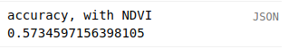

<!-- If you'll recall, we talked earlier about highly correlated features. Because NDVI is calculated from Bands 3 and 4, the three bands are highly correlated. This is increasing the dimensionality of our training samples. What would happen if we dropped Bands 3 and 4, and only kept NDVI?

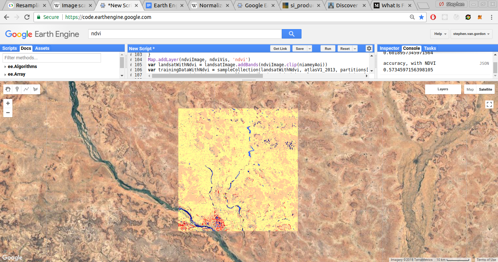

A 0.5% increase in accuracy isn't very significant, but the reduction in dimensionality can have some advantages, for example if the training set had many features or if we were trying to reduce the size of the training set due to Earth Engine's constraints. -->

## Including Multiple Seasons

So far, we've only used Landsat data from the early dry season. However, we can sample from other parts of the year as well. Our goal here, as always, is to add even more information that distinguishes land cover classes. The idea is that there might be land cover classes that look similar in the images taken in the later part of the year, and there might be land cover classes that look similar in the images taken in the early part of the year, but there will be fewer land cover classes that look similar in both sets of images.

First, we need to decide what time period we would like to sample. We'd like to go with a time towards the start of the rainy season, so that it is possible to get a serviceable amount of cloud free imagery. So, let's take a look at the annual precipitation pattern for our classification zone.

~~~
print(ui.Chart.image.series(chirpsCollection.filterDate('2013-01-01', '2013-12-31'), classificationZone));
~~~
{:. .source .language-javascript}

So let's say March 15 to April 15. I'm kind of choosing those dates based on intuition, so that's something that you can test out to find better dates, or that you can tailor to individual zones.

Now we'll create a function to create an early year filter, like we did for the late part of the year. We can just copy and paste that function and change the dates as necessary. Remember you can use <kbd>Ctrl</kbd>+<kbd>🖰</kbd> to create a cursor in multiple locations

~~~
function getEarlyYearFilter(year) {
  return ee.Filter.or(
    ee.Filter.date( year - 1 + '-03-15',  year - 1 + '-04-15'),
    ee.Filter.date( year     + '-03-15',  year     + '-04-15'),
    ee.Filter.date( year + 1 + '-03-15',  year + 1 + '-04-15')
  )
}
~~~
{:. .source .language-javascript}

Now we need to create a Landsat image for the early part of the year, like we did earlier for the late part of the season.

~~~
var earlyYearLandsat = landsat7Collection
  .filterBounds(classificationZone)
  .filter(getEarlyYearFilter(2013))
  .map(maskLandsat)
  .median()
  .clip(classificationZone)

var multiSeasonImage = landsatImage.addBands(earlyYearLandsat)
~~~
{:. .source .language-javascript}

~~~
var multiSeasonBands = multiSeasonImage.bandNames().remove('b1')
assessClassification(multiSeasonImage, samplingPoints, multiSeasonBands, 'multiseason classification')
~~~
{:. .source .language-javascript}

<!-- So, how does our classifier do?

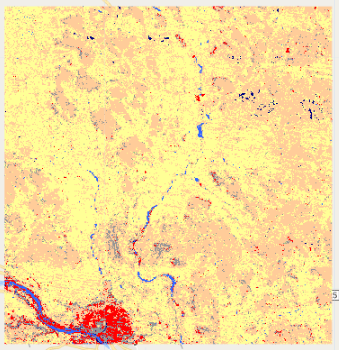

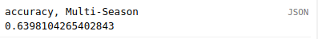

64.0% accuracy: not bad! -->

You might try exploring adding images from different seasons. One thing to watch out for is dimensionality: at some point, adding more features will begin to reduce the classifier's performance. Then there are practical considerations: for some regions, it is simply not possible to get enough cloud-free images for certain times of year.

<!-- We'll drop this for now -- it requires us  -->
<!-- ## Sampling a Collection Instead of an Image

So far, we've been aggregating our Landsat images and then sampling the aggregate. However, there's no reason why we couldn't sample each image individually. Why would we want to do this? By sampling each image, instead of aggregating and then sampling, we increase the amount of training data available. Instead of sampling one image and having 500 training samples, we can sample 30 images and have over 5000 training samples.

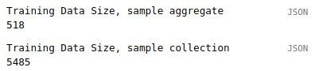

The scenes that we sample will all be taken at different times during the early dry season and will all be taken with different aerosol qualities (ie, on some days it will be hazier than others). This exposes our classifier to a broader spectrum of values, and gives a more robust and flexible classifier that generalizes better.

The best part is that our process is already set up to handle sampling a collection of images; all we need to do is remove the call to `.median()`:

```
/*
  Sample a collection of images, increasing the amount of training data available.
*/

print(ee.FeatureCollection(partitions[0]).size())
var trainingCollection = landsat7Collection
  .filterBounds(niameyAoi)
  .filter(earlyDrySeasonFilter2013)
  .map(maskLandsatImage)

print('Training Data Size, sample aggregate',trainingData.size())
print('Training Data Size, sample collection',trainingDataCollection.size())

var trainingDataCollection = sampleCollection(trainingCollection, atlasV1_2013, partitions[0])
var testingDataCollection = sampleCollection(trainingCollection, atlasV1_2013, partitions[1])
var classifierCollection = baseClassifier
  // Provide classifier with band names for spring and fall images
  .train(trainingDataCollection, 'b1', ['B1', 'B2', 'B3', 'B4', 'B5', 'B7'])

print('accuracy, Sample Collection', testingDataCollection.classify(classifierCollection).errorMatrix('b1', 'classification').accuracy())
renderClassification(trainingCollection.median().clip(niameyAoi).classify(classifierCollection), 'Sample Collection')
```

We can even incorporate some of the other techniques that we've been discussing, such as including NDVI or adding other datasets, by mapping over the image collection.

```
var trainingCollection = landsat7Collection
  .filterBounds(niameyAoi)
  .filter(earlyDrySeasonFilter2013)
  .map(maskLandsatImage)
  .map(function(image) {
      return image.addBands(ee.Image("USGS/SRTMGL1_003").clip(niameyAoi))
    })
```

One motivation for sampling collections instead of single images is to try to compensate for [the SLC-off error](https://landsat.usgs.gov/slc-products-background). The SLC-off error results in significant gaps in Landsat 7 images, and one side effect that we have noticed is some zones experience a zig-zag pattern of incorrect classification. Sampling from multiple scenes attempts to rectify this issue by reducing the side effects of aggregating SLC-off scenes.

### Disadvantages of sampling collections

By sampling a collection instead of an aggregated image, we lose some of the advantages of aggregation. Part of the purpose of taking a median, for example, is to insulate the classifier from extreme, noisy, and probably-wrong inputs. When we take median values, for example, it's less important that we filter the dataset for outliers of artifacts. To compensate for this, we might consider improving our image pre-processing or filtering out scenes with a high percentage of cloud cover.

Another disadvantage is simply practical: Earth Engine classifiers can only handle so many features. The practical limit is somewhere around 10,000; many more features than that and our classifier will time-out before finishing. -->

## Including Neighboring Zones

At this point, we're using a series of classifiers to classify a series of zones. One pitfall with this  method is that there can be discrepencies between two zones. One class might be missing from the training data in a zone, or it might not be present in sufficient numbers for the classifier to be able to learn that class well enough for it to be able classify that class.

You can see an example of the boundary issue in the image below: there is a clear difference in how the classifier on the right and the classifier on the left are classifying the agriculture vs savanna.

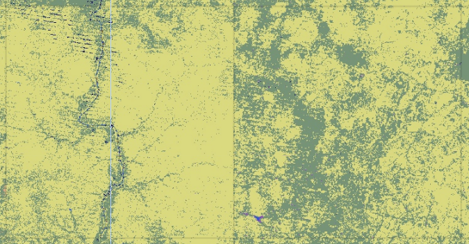

This is the down side of using the zone system: our classifiers are more accurate, but they are less able to generalize. However, it is possible for us to 'smooth' these zone boundaries. By sampling the zones around the zone we seek to classify, we can get a more balanced training set, and a more versatile classifier, without a loss in accuracy. Let's look at how we can do this.

First, let's demonstrate the zone boundary issue. We're going to classify the zone next to our area of interest, and look to see if there's a noticeable border between the two zones. First, let's get a zone that neighbors our AOI.

~~~
/*
  Including neighboring zones
*/

var neighborZonePoint = /* color: #d63000 */ee.Geometry.Point([-12.444763162638992, 12.427175804835738]);
var neighborZone = ee.Image.random()
  .multiply(10000000)
  .toInt()
  .reduceToVectors({
    crs: atlasImage.projection(),
    scale: zoneSize,
    geometry: neighborZonePoint
  });

var neighborImage = landsat7Collection
  .filterBounds(neighborZone)
  .filter(getLateYearFilter(2013))
  .map(maskLandsat)
  .median()
  .addBands(atlasImage)
  .clip(neighborZone)

var neighborPoints = ee.Image
  .random()
  .multiply(100000)
  .toInt()
  .reduceToVectors({
    crs: labelProjection,
    geometry: neighborZone,
    scale: labelProjection.nominalScale()
  })
  .map(function(feature) {
    var centroid = feature.centroid(5)
    return centroid
  })

Map.addLayer(neighborZone, {}, 'neighborZone')
assessClassification(neighborImage, neighborPoints, landsatBands, 'neighbor classification')
~~~
{:. .source .language-javascript}
<!--  -->

In the Kedougou example, you can see that the neighbor classification is doing much better. Part of the reason for this is the boundary issue. There is a river that runs through these two zones, but the river only intersected with the sampling points in the northern zone. As a result, the `water` class is missing from the southern zone. As a result, there's a noticeable difference in the the images are classified in the two zones. To smooth the boundaries between the zones, we're going to sample data from outside of our zone as well as inside. This is similar to a 'kernel' in image processing:


Our process is going to be as follows:

* Generate the sampling points for the AOI as normal.
* Expand the AOI so that it encompasses all neighboring zones, and generate its sampling points.
* Limit the neighboring zone sampling points, so that our new sampling points are 50% in the original AOI, and 50% in the neighboring zones.
* Combine the AOI sampling points and neighboring zone sampling points and proceed with the classification process as normal.

<hr>
We have the sampling points from our AOI (`samplingPoints`). Let's get our neighboring sampling points. First, we need to expand our AOI so that it encompasses all neighbor zones. We're going to do this using `.buffer()`. `.buffer()` takes a geometry and expands it by a distance in meters (or shrinks it if the distance is negative). We want to expand our zone by the size of the zone.

~~~
var expandedZone = classificationZone.buffer(zoneSize)
Map.addLayer(expandedZone, {}, 'expanded zone')
~~~
{:. .source .language-javascript}

We want to create sampling and testing points for the zone itself as we would normally. We only want testing points that are inside of the zone, but we want training points from outside of the zone. Furthermore, we don't want to take every single training point inside of our buffered geometry, or the ratio of training points inside the zone to training points outside of the zone would be around 8:1, and signal from outside of the zone would overwhelm signal from inside of the zone.


```
var bufferedAoi = niameyAoi.buffer(bufferDistance)
var neighborPoints = getCenterPoints(bufferedAoi, atlasV1_2013)
Map.addLayer(neighborPoints)
```

With the expanded AOI, we generate a feature collection of sampling points, as we do normally. We then randomly select as many points from that collection as there are points in the AOI. We then filter out any points that fall within the original AOI.

This is an important filter! We need to make sure that there aren't any testing points that fall within both the training set and the testing set. When testing data is available in the training data, it is called *leakage*. That's bad! Leakage is when your model has access to data that it shouldn't. In this case, the model is getting to peek at some of the validation data. When we actually try to create new land cover maps, the model won't be able to peek at anything: all of the data will be unknown. Leakage results in artificially high estimate of the classifier's accuracy: you think that the classifier is doing well, because it's 'cheating', but when exposed to real data, it will perform poorly.

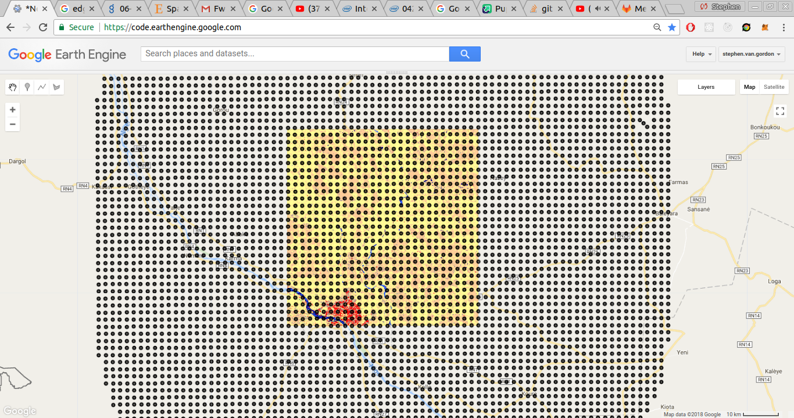

```
var bufferedPoints = getCenterPoints(bufferedAoi, atlasV1_2013)
  // Add a random column
  .randomColumn()
  // Select as many points from the neighbor points as there are points in the AOI, sorted randomly
  .limit(samplingPoints.size(), 'random')
  // Drop all columns from the sampling points, thereby discarding the random column
  .select([])
Map.addLayer(bufferedPoints)
```

We then sample these points and add them to our training data. We don't include these points in the feature collection that we split into the training and testing data, because we only care how well the classifier does at classifying our AOI.

```
// Sample our landsat image at the neighborPoints
var bufferedData = sampleCollection(ee.ImageCollection(landsatImage), atlasV1_2013, bufferedPoints)
```
Finally, we merge the neighbor data with the training data, and proceed with the classification process as normal.

```
// Merge neighborPoints with the training points from the AOI
bufferedData = bufferedData.merge(trainingData)
```
```
/*
...
*/
```

How do our results look? Looking good. It looks like the zone boundary has been significantly reduced.


We also get a pretty hefty bump in accuracy:


Which is great!

## Review
We've explored a number of ways that we can improve the quality of our inputs. We looked into adding new features, either by including new datasets or by creating new features out of existing features. We looked into increasing the number of samples available in the training data by sampling multiple satellite images for a single datapoint. And finally we looked at smoothing the boundaries between zones by sampling data from the zones adjacent to our area of interest.
