The Atlas and Atlas V2 datasets are land cover maps of the West African Sahel. In this lesson, we will discuss these datasets, how they were produced, how they are related, and how you might use them in your map.

## Description of Datasets

We are going to be talking to you about the Atlas and Atlas V2 datasets.

## Atlas Dataset

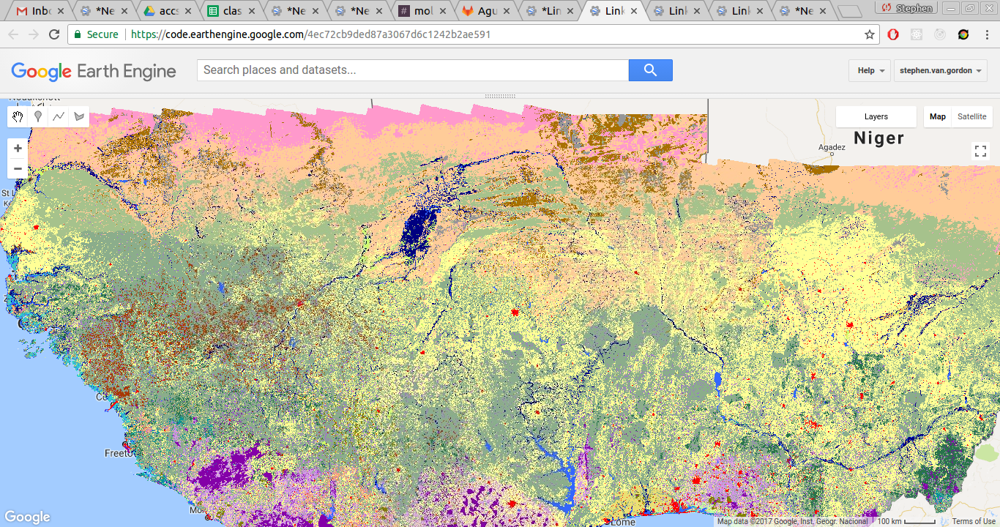
_2013 Atlas Classification_

The [West Africa Land Use Land Cover Time Series Atlas (Atlas)](https://eros.usgs.gov/westafrica/) is a land cover dataset produced by USGS, USAID, and CILSS. This land cover dataset was produced by experts in West Africa, who hand classified 1,200,000 pixels. The dataset is available at 2km resolution, and three maps are available: 1975, 2000, and 2013. Advantages of this dataset include its high reliability and its class system, which was chosen by researchers in the region and is suited to West Africa. One disadvantage of this dataset is its coarse resolution (2km). It is also very time and labor intensive to produce; it takes a large number of researchers over a year to produce a land cover map for a year.

### Atlas V2 Dataset
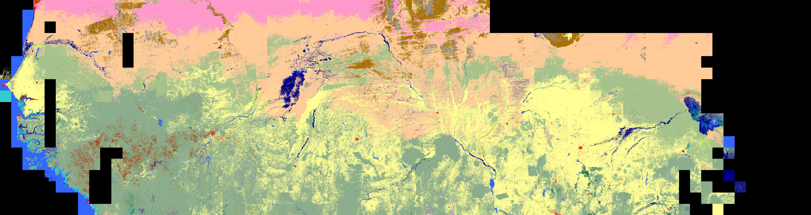
_2016 Atlas V2 Classification_

The Atlas V2 is a land cover dataset produced by Mollie Van Gordon at the University of California, Berkeley. This dataset uses the Atlas as training data to perform machine classification of satellite imagery. By using the Atlas data to train machine learning algorithms, we can produce land cover maps of the West Africa region that are of a similar accuracy as the Atlas dataset, but at a higher resolution. Furthermore, by taking advantage of the Google Earth Engine cloud computing platform and using publicly available datasets, we can create land cover maps at no cost, and annually.

Currently, the V2 team has produced a 30m land cover dataset using Landsat images for every year between 2000 and 2016. This dataset is currently available on Google Earth Engine. Furthermore, the process for creating these datasets is flexible. Different datasets can be used in place of both Landsat and Atlas. For example, researchers could use Sentinel imagery to produce a map at 20m resolution, or researchers could hand classify a small area of interest to produce a land cover map at an even higher accuracy.

Currently, not all of the region covered by Atlas is classified in Atlas V2. The southern coast of West Africa has been excluded, due to issues with finding cloud-free images. Southern Chad has also not been classified, due to issues with scale (in Atlas, Chad is at 4km resolution). Both of these omissions are due to time constraints: there's no reason that we couldn't classify the entire region, and in fact we're eager to. We just haven't had time yet!

## Loading Atlas Images

We will first discuss how to load the Atlas dataset and display it in Earth Engine. The Atlas V2 team has loaded the Atlas dataset into Earth Engine. However, we will show you the process that would be used to upload this dataset. It is the same process that you would use to load a custom raster dataset.

There are many datasets accessible through the Earth Engine explorer, but Atlas is currently one of them! To upload this dataset into Earth Engine, we will:
* Download the datasets from the USGS website
* Upload the Atlas GeoTIFF into Earth Engine
* Set upload parameters

### Downloading Atlas Data

Atlas data is available from [the USGS website](https://eros.usgs.gov/westafrica/data-downloads). Here you can download the Atlas data. The regional datasets are available at the top. We'll try loading the dataset for 2000 (`West Africa Land Use Land Cover 2000`). Download and unzip that file. Also available are higher resolution datasets for The Gambia and Cape Verde, as well as a .csv file of summary statistics.

In that folder, you have everything you would need if you were to want to open the file in another GIS program, like ArcGIS or ESRI. You can view metadata about the Atlas dataset in the files `swa_2000lulc_2km.tif.aux.xml` and `swa_2000lulc_2km.tif.xml`.

### Selecting Files to Upload
Let's upload the data into Earth Engine. Proceed over to the Earth Engine code editor at (https://code.earthengine.com). In the assets tab, click the `New` button and select `Image Upload`.

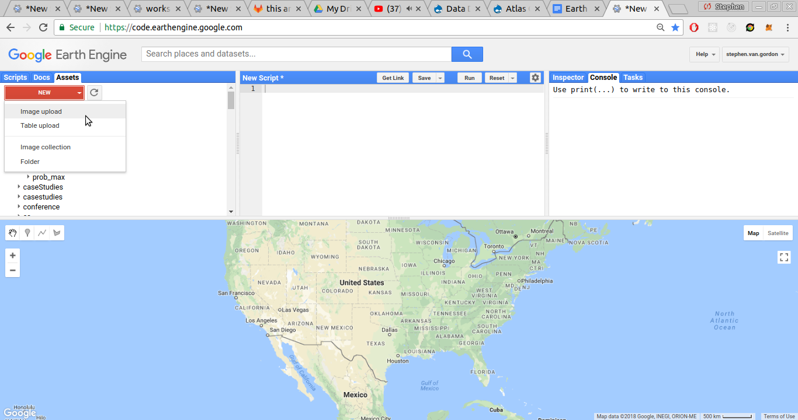

We now need to tell Earth Engine what files we want to upload. Navigate to the directory where we unzipped the Atlas data to, and select the files `swa_2000lulc_2km.tfw` and `swa_2000lulc_2km.tif`. If you're download a different year or a different dataset, the files will have different names, but you're going to want one `.tfw` file and one `.tif`/`.tiff` file.

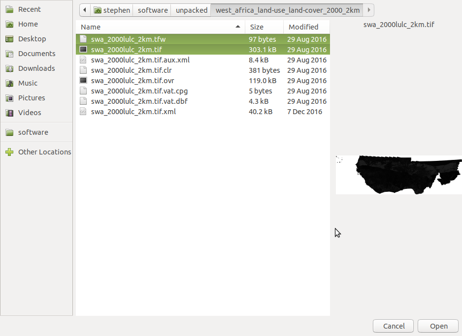

### Setting Upload Parameters

We now need to set the upload parameters that determine how Earth Engine will process our file. You can [read more about Earth Engine image uploads here](https://developers.google.com/earth-engine/image_upload).

#### Set Asset Id
*Optional:* We can change our upload's asset ID, if you don't like the default asset ID. The asset ID is used to import images and tables into our code. It can be changed later. Asset ids can only contain alphanumeric characters (A-Z, a-Z, 0-9) and "-", "\_", and "/". No spaces or accented characters are allowed. If you would like an asset to be loaded to a folder inside of your asset repository, you can provide the path to that folder, eg `path/to/folder/assetId`

#### Set start or end date
*Optional:* We can give our asset a start and an end date. This will allow us to do things like filter datasets based on time. Let's give our upload a start time. Start times have the format `YYYY-MM-DD`.

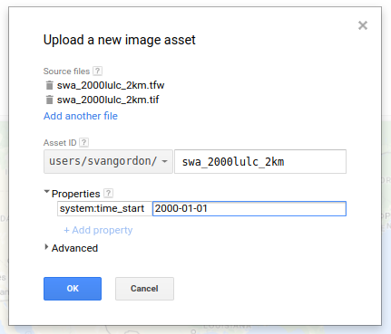
_Setting start and end date._

Our dataset is for the entire year, so let's make its start time `2000-01-01`. Let's also give our new image an end time. Click `+Add property`. For name, put `system:time_end`, and for the value, put `2000-12-31`.

#### _Important:_ Setting pyramiding policy
Pyramiding policy, determines how Earth Engine will resample an image when moving between scales (ie, levels in the '[image pyramid](https://developers.google.com/earth-engine/scale#image-pyramids)'). The default pyramiding policy is `Mean`, meaning that Earth Engine will take an average value of the pixels when downscaling an image. For categorical variables, like land cover classes, this results in garbage output. We want to change the pyramiding policy to `Mode` or `Sample`, either of which are appropriate for categorical variables. Pyramiding policy cannot be changed after an asset is uploaded.

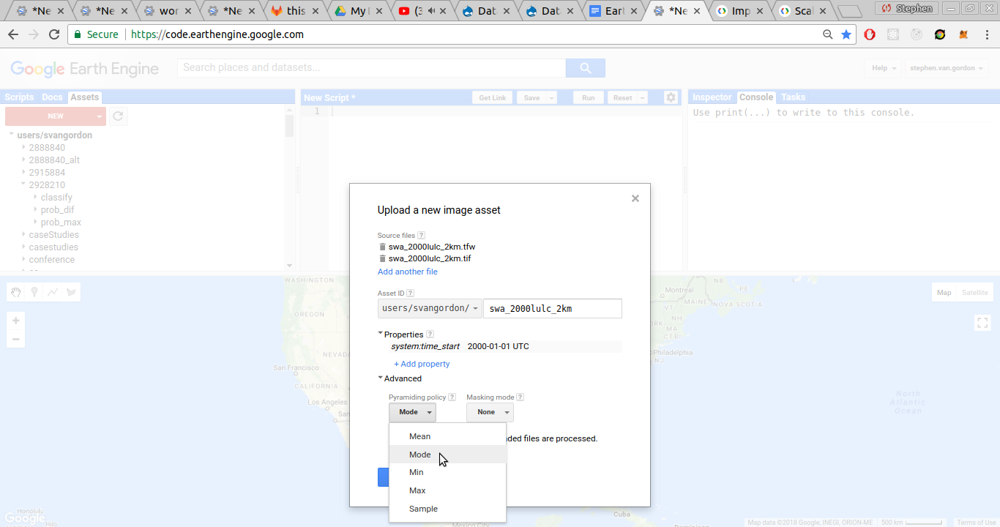
_Setting pyramid policy to Mode._  

#### Setting Masking Mode
The masking mode provides us a way to tell Earth Engine about the image's No Value pixels. Reading the XML data for the Atlas dataset, we can see that the no data pixels are given a value of 0. By telling Earth Engine that those are no data pixels, those pixels will be automatically masked on input.

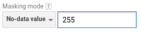
_Setting masking mode._  

(Unfortunately, some of the Atlas datasets also have 0 as a no data pixel.)

#### Starting Upload
Now that we have set our upload properties, we're ready to submit our upload.

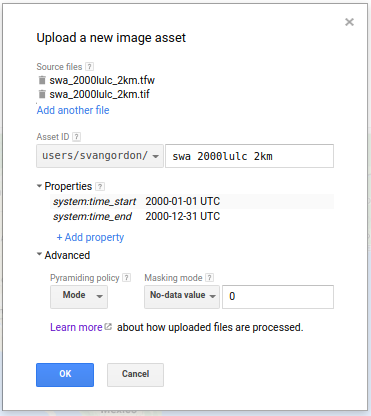
_Upload ready for submission._

First, our files will be uploaded from our computer to the Earth Engine servers. During this process, it's important not to refresh or close the page. Once the files have been successfully, uploaded, they will be processed on the Earth Engine servers, and we can close our browser.

#### Viewing Uploaded Asset
When the image upload is completed and processed ('ingested' is the Earth Engine term), we can view it in Earth Engine in the assets tab. It should look like this:

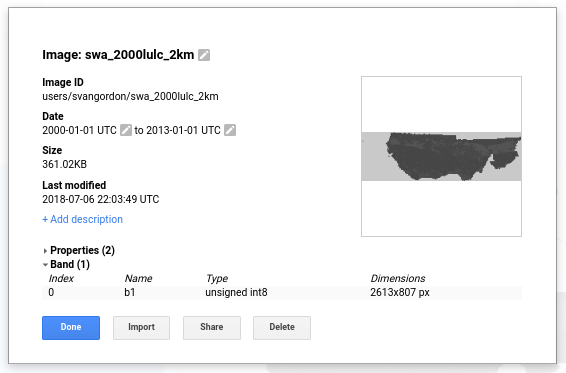
_An uploaded Earth Engine asset._

You'll notice that the uploaded image has one band, called `'b1'`. There are ways that we could rename it, but for now that's how we'll refer to the land cover band.

## Accessing Atlas Images in Earth Engine
Let's load our Atlas image in Earth Engine. As a reminder, when we load an image in Earth Engine, we do it like this:

var image = ee.Image("path/to/asset")


### Display Atlas Images
Open up your code editor at by going to https://code.earthengine.google.com. The Atlas images are available in the directory `/users/svangordon/conference/atlas`. Let's load the Atlas image for 2000 and add it to the map.

var atlas_2000 = ee.Image("users/svangordon/conference/atlas/swa_2000lulc_2km")
Map.addLayer(atlas_2000)


This will display the Atlas image in grayscale.
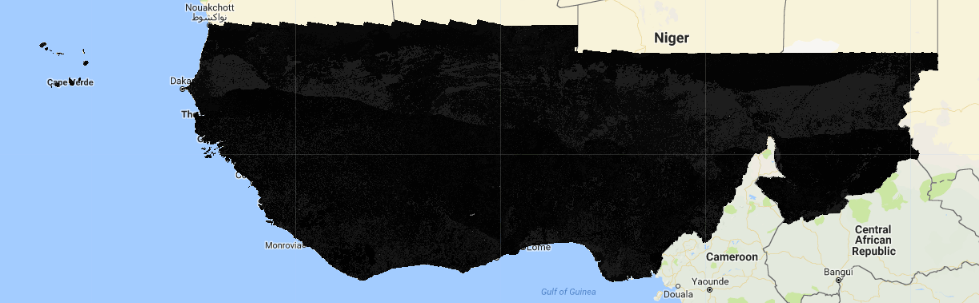
_Atlas 2000 image in grayscale._

As you will recall from the Earth Engine workshop, if we want our Atlas image to look nice, we'll have to provide it with visualization parameters. From the Atlas metadata (`swa_2000lulc_2km.tif.aux.xml`), we can determine the RGB color values for the different classes. Using some programming wizardry, we can convert those RGB values to hex values that are compatible with Earth Engine. I won't force you to do this yourself, because it's a real pain (and if you ever need to convert RGB colors to hexadecimal colors, you can do so here: https://www.colorhexa.com/). The palette is provided in the code below, and can also be imported from the workshop tools (`require('users/svangordon/lulc-conference/workshopTools')`).


var atlasPalette = [
  "8400a8", // Forest / Forêt
  "8bad8b", // Savanna / Savane
  "000080", // Wetland - floodplain / Prairie marécageuse - vallée inondable
  "ffcc99", // Steppe / Steppe
  "808000", // Plantation / Plantation
  "33cccc", // Mangrove / Mangrove
  "ffff96", // Agriculture / Zone de culture
  "3366ff", // Water bodies / Plans d'eau
  "ff99cc", // Sandy area / surfaces sableuses
  "969696", // Rocky land / Terrains rocheux
  "a87000", // Bare soil / Sols dénudés
  "ff0000", // Settlements / Habitations
  "ccff66", // Irrigated agriculture / Cultures irriguées
  "a95ce6", // Gallery forest and riparian forest / Forêt galerie et formation ripicole
  "d296e6", // Degraded forest / Forêt dégradée
  "a83800", // Bowe / Bowé
  "f5a27a", // Thicket / Fourré
  "ebc961", // Agriculture in shallows and recession / Cultures des bas-fonds et de décrue
  "28734b", // Woodland / Forêt claire
  "ebdf73", // Cropland and fallow with oil palms / Cultures et jachère sous palmier à huile
  "beffa6", // Swamp forest / Forêt marécageuse
  "a6c28c", // Sahelian short grass savanna / Savane sahélienne
  "0a9696", // Herbaceous savanna / Savane herbacée
  "749373", // Shrubland / Zone arbustive
  "505050", // Open mine / Carrière
  "FFFFFF"  // Cloud / Nuage
]


When displaying categorical bands in Earth Engine, the band values must be consecutive integers. If not, EE will try to stretch the colors in the palette as if they were.

Map.addLayer(atlas_2000, {min:1, max:78, palette: atlasPalette})


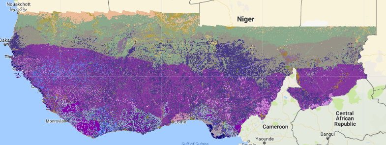
_Atlas image shown with incorrectly stretched colors._

### Remapping Classes
Let's write a function that will remap an Atlas image so that its classes are consecutive integers, suitable for display, and display it on the map.

We'll need a list of the classes present in the Atlas dataset. We can get that list from the Atlas metadata; it's also in the code below and in the workshop tools.

var atlasRawClasses = [1,2,3,4,6,7,8,9,10,11,12,13,14,15,21,22,23,24,25,27,28,29,31,32,78,99]


Our function will take an Atlas (or Atlas V2) image and a string that will be used to name the layer.

function displayAtlasClassification(atlasImage, layerName) {
  /*...*/


We will now remap the image. When we remap an image, we provide it with a list of `from` values and list of `to` values. Values in the `from` list are converted to the matching value in the `to` list; unmatched values are dropped.
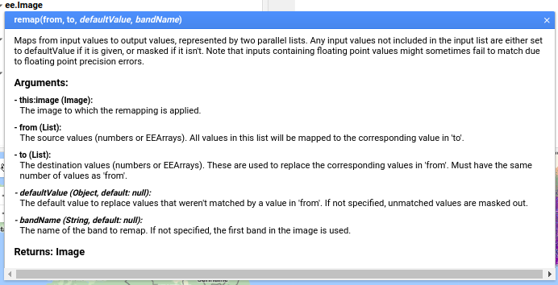
_Documentation for `ee.Image().remap()`_

Our `from` list is going to be the Atlas classes. We want our `to` list to be a list of numbers between `1` and `n Atlas classes`, so we'll use an `ee.List.sequence` of that length.


  /*...*/
  var remappedImage = atlasImage.remap(atlasRawClasses, ee.List.sequence(1, atlasRawClasses.length))
  /*...*/


We would like to keep the original values on the image, to make them easier to look at with the inspector.

  /*...*/
  atlasImage = atlasImage.addBands(remappedImage)
  /*...*/


Now let's set up our visualization parameters.

  /*...*/
  var atlasViz = {
    min: 1,
    max: atlasRawClasses.length,
    bands: ['remapped'],
    palette: atlasPalette
  };
  /*...*/


And finally, display it on the map, with the layer name that was passed with the function.

  /*...*/
  Map.addLayer(atlasImage, atlasViz, layerName)
}


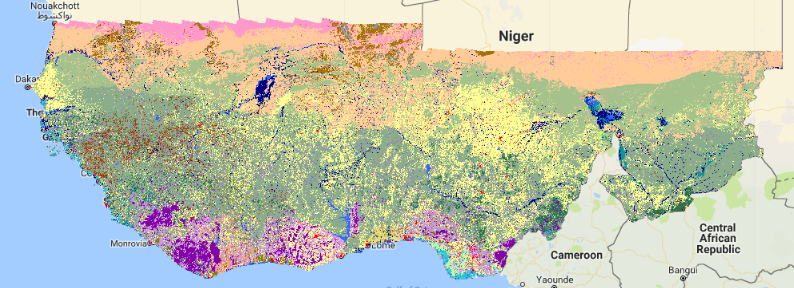
_Atlas 2000 image displayed with proper colors._

### OPTIONAL: Displaying all Atlas images at once
For convenience, it would be nice to display all Atlas images at once. Let's use a clever trick to do this.

Atlas images are available as a collection. Let's load that:

var atlasCollection = ee.ImageCollection('users/svangordon/conference/atlas/atlasCollection')


We know that there are Atlas images in 1975, 2000, and 2013. If we create a local Javascript array (not an `ee.List`), we can map over that array, use each year to the Atlas collection, and display the resulting image on the map.


var atlasYears = [1975, 2000, 2013]
atlasYears.map(function(year) {
  var atlasImage = atlasCollection
    .filterDate(year + '-01-01')
    .first()
  atlasImage = ee.Image(atlasImage)
  // print(atlasImage)
  displayAtlasClassification(atlasImage, 'Atlas ' + year)
})


Take a few minutes to look around the map. You can use the inspector to view the class values at different pixels. Try turning different layers on and off to look at different years.

## Displaying Atlas V2

Now that we've seen how to display the Atlas data, let's display the Atlas V2 data. This works in the same way as displaying the Atlas data. Atlas V2 images are located at `users/svangordon/conference/atlas_v2/classify/classificationYear`, and a collection of images can be found at `users/svangordon/conference/collections/atlas_v2/classify`. They can also be imported from the workshop tools.

Let's load an Atlas V2 image and display it.

var atlasV2_2013 = ee.Image('users/svangordon/conference/atlas_v2/classify/2013')
displayAtlasClassification(atlasV2_2013, 'Atlas V2 2013')


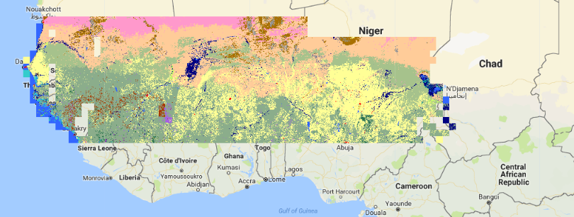
_Atlas V2 2013_

We can also use the technique we used earlier to display all Atlas V2 images at once.


var atlasV2Collection = ee.ImageCollection('users/svangordon/conference/atlas_v2/collections/classify')
var atlasV2Years = [2000, 2001, 2002, 2003, 2004, 2005, 2006, 2007, 2008,
                    2009, 2010, 2011, 2012, 2013, 2014, 2015, 2016];
atlasV2Years.map(function(year) {
  var atlasV2Image = atlasV2Collection
    .filterDate(year + '-01-01')
    .first()
  atlasV2Image = ee.Image(atlasV2Image)
  // print(atlasImage)
  displayAtlasClassification(atlasV2Image, 'Atlas V2 ' + year)
})


## Conclusion
This lesson, we've discussed some background about the Atlas and Atlas V2 datasets. We have demonstrated how to display both the Atlas and Atlas V2 datasets.

## Questions
???
